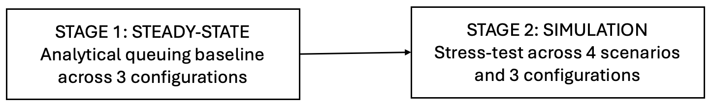
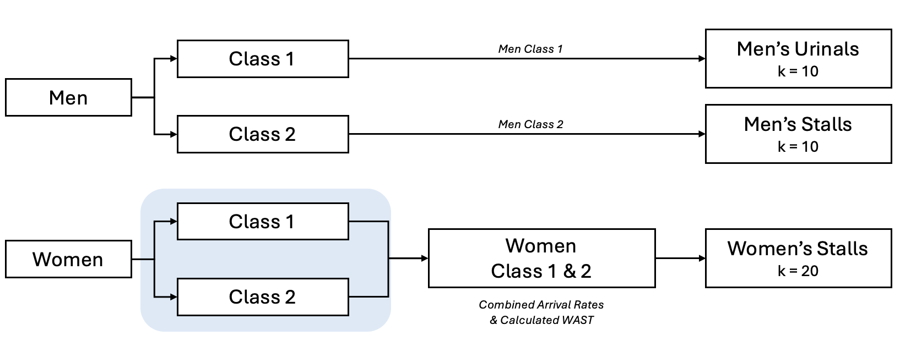
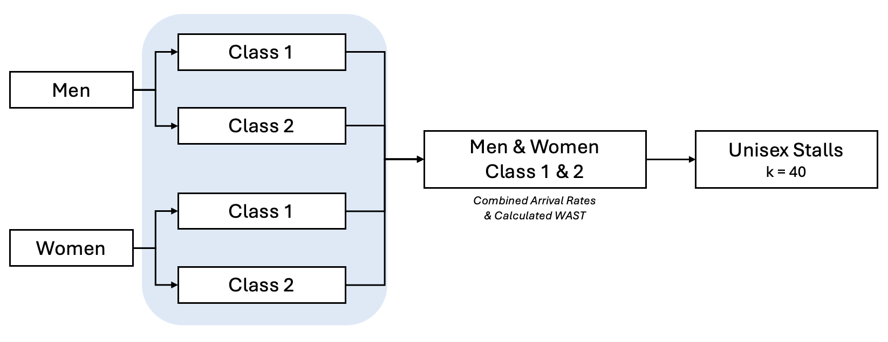
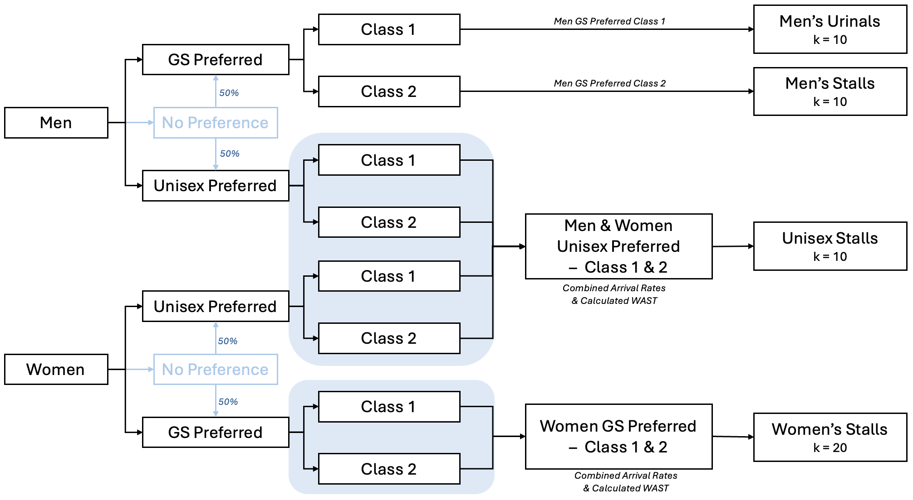

```{r}
#| label: setup
#| include: false

knitr::opts_chunk$set(echo = TRUE, eval=TRUE, error=TRUE, cache=FALSE)
```

\newpage

# 1. Introduction and background

## 1.1 The Business Problem

A high-capacity concert hall operates under a strict 25-minute intermission window. This compressed break triggers a simultaneous surge in demand as patrons rush to restroom facilities, creating severe congestion and extended queues. Management has received an increasing volume of complaints regarding long wait times and the lack of an inclusive restroom design, a pattern that risks damaging the venue's reputation and driving away repeat customers.

The challenge is compounded by strict physical and financial constraints. The total restroom capacity is fixed at 40 units with no structural expansion permitted. Any redesign must therefore work within this fixed envelope. The question is not how many units to build, but how to allocate the existing 40 most effectively. This report provides management with a rigorous, data-driven analysis to support that decision.

## 1.2 Stakeholders, Costs, and Benefits

This restroom configuration challenge directly affects patrons and the venue's operational management in distinct ways.

Women patrons on average require longer service times and may face disproportionate waiting burdens under layouts that underallocate stall capacity to them. Men patrons use a combination of urinals and stalls with shorter average service times but remain subject to congestion under peak demand.

Beyond service time differences, patron preferences for facility type also vary. Some strongly prefer gender-segregated spaces for privacy, while others rely on unisex facilities for comfort and inclusivity. A layout that ignores this diversity risks excluding a portion of the audience entirely. Importantly, facility preference is not merely a matter of convenience. For some patrons, access to an appropriate facility is tied to their sense of dignity and personal identity, making inclusive design a matter of basic respect rather than optional comfort.

Event organisers and venue management represent another stakeholder group. The gender composition of an audience is not fixed. It is shaped by the nature of the performance, and organisers who programme events targeting a specific demographic directly influence the demand profile the restroom system must handle. A venue that cannot accommodate varied audience compositions reliably will face operational failures across different event types, not only under its current programming.

The costs of inaction are tangible and immediate. Patrons who cannot complete their restroom visit within the intermission window risk missing the opening minutes of the next act, a direct degradation of the experience they paid for. Beyond this, sustained queuing reduces time available for concession spending, lowers overall satisfaction scores, and increases the likelihood that patrons do not return for future events. A well-designed reallocation, achievable at no additional construction cost, offers equally concrete benefits. Shorter queues allow patrons to return to their seats on time, spend more at concession stands, leave with a better impression of the venue, and are more likely to attend again.

## 1.3 The Fairness Lens and Analytical Scope

Because patron service times and facility preferences differ across groups, a layout optimised purely for aggregate efficiency can still leave one group suffering disproportionately long delays while another experiences none. This is the central tension that the patron complaints reflect. It is not simply that queues are long overall, but that the burden falls unevenly.

For this reason, our analysis adopts Direction A: Fairness and Stakeholder Disparity as its primary lens, directly motivated by the patron complaints that management has received, which point not only to long overall queues but to the unequal burden placed on specific patron groups. Each configuration is evaluated through two complementary frameworks: a Totalitarian approach that maximises overall average satisfaction across all patrons, and a Rawlsian approach that prioritises the experience of the worst-off group. Together, these allow us to identify designs that are both collectively effective and locally equitable.

## 1.4 Evaluated Configurations and Report Objectives

To identify the optimal allocation within the 40-unit constraint, this report evaluates three distinct restroom configurations:

-   Configuration 1 — Status Quo (Gender-Segregated Baseline): 20 women's stalls, 10 men's urinals, and 10 men's stalls. This serves as the comparative baseline representing current operations.

-   Configuration 2 — All Unisex (Fully Integrated): All 40 units converted to universal all-gender stalls, maximising resource pooling across all patron groups.

-   Configuration 3 — Hybrid Model (Compromise Allocation): 15 women's stalls, 10 men's urinals, 5 men's stalls, and 10 unisex stalls, combining the efficiency of shared spaces with dedicated private areas.

The analysis proceeds in two stages. First, steady-state queueing analysis establishes the baseline performance of each configuration under standard operating conditions. Second, each configuration is stress-tested through simulation under dynamic arrival scenarios, including cases where audience gender composition is heavily skewed toward one group, as naturally occurs when event demographics vary significantly across different performances.

This two-stage approach ensures that recommendations hold not only under ideal conditions but under the realistic pressures a working venue faces across its event calendar, with the ultimate objective of providing management with a clear, evidence-based recommendation on which configuration best minimises intermission queuing disruptions while delivering a fair and inclusive experience for all patrons.

\newpage

# 2. Analytical Methods

The central analytics problem is to determine which restroom configuration minimises patron waiting time and maximises equitable satisfaction across stakeholder groups, subject to the fixed 40-unit capacity constraint and the strict 25-minute intermission window. Based on the case data, each gender arrives at a rate of 3.2 patrons per minute, giving a combined arrival rate of λ = 6.4 patrons per minute across all genders (overall population rate).

To robustly evaluate the three restroom configurations, this study employs a two-stage analytical framework. We transition from a highly structured, static queueing model to a dynamic, stochastic simulation designed to stress-test the configurations under realistic, peak-demand intermission pressures.



\[xxx-placeholder for visual flowchart of the two-stage analytical framework-xxx\]

The primary measures of success for this analysis are: (1) Totalitarian Satisfaction Score (Tr), measuring aggregate patron satisfaction across all groups; (2) Rawlsian Satisfaction Score (Mr), measuring the satisfaction of the worst-off patron group; and (3) Queue Failure Rate, measuring the proportion of patrons unable to complete their restroom visit within the intermission window.

Supporting these primary measures, fundamental queueing metrics including average waiting time (Wq), average queue length (Lq), and server utilisation (ρ) are reported for each configuration to provide operational context and validate the satisfaction score calculations.

## 2.1 Stage 1: Steady-State Modeling

We begin by establishing a theoretical baseline using analytical queueing equations. To set a clean, idealised benchmark, Stage 1 assumes a perfectly balanced 50:50 gender demographic split and a uniform Poisson arrival rate throughout the intermission, meaning patrons arrive at a constant average rate (λ) over the entire break with no sudden rushes.

**Analytical Inputs, Outputs, and Assumptions**

The Stage 1 model is built on the following inputs, outputs, and assumptions:

|   | Detail |
|------------------------------------|------------------------------------|
| **Inputs** | Arrival rate (λ = 6.4 patrons/minute), gender demographic split (50:50 under baseline conditions), and historical service time parameters (mean and standard deviation) drawn from the case data for each patron class |
| **Outputs** | Expected waiting time in queue (Wq) and server utilisation (ρ) for each configuration |
| **Assumptions** | Poisson arrivals, infinite queue capacity, FIFO service discipline, independence between segregated queues, and Gamma-distributed service times parameterised from the empirical case data |

Note that this table covers Stage 1 only. Stage 2 inputs, outputs, and assumptions are addressed within 2.2 and 2.3 respectively, since the simulation introduces additional parameters that are best explained in context.

To model this baseline with mathematical rigour, we leverage the historical data provided in the case description, which includes the empirical mean service time and standard deviation (σ) for different restroom activities. With these explicit parameters, we can calculate the exact service time coefficient of variation (CV = σ/Mean). Because the empirical service time data yields a coefficient of variation CV ≠ 1, the M/G/k model is adopted as the most appropriate baseline, with the Allen-Cunneen approximation used to compute expected waiting times.

The M/G/k queueing model (Poisson Arrivals, General Service Times, k Servers) computes the expected waiting time in queue (Wq) under steady-state conditions as follows:

$$W_q(M/G/k) \approx \frac{C_a^2 + C_s^2}{2} ⨯ W_q(M/M/k)$$

Where:

-   $C_a^2$ is the arrival CV ($1.0$ due to our perfect Poisson arrival assumption).
-   $C_s^2$ is the service time CV, calculated directly from the provided historical mean and standard deviation.
-   $W_q(M/M/k)$ is the expected waiting time of a standard $M/M/k$ system.

### Application to the Three Configurations

We apply this $M/G/k$ mathematical framework to evaluate the expected waiting times across our three layouts:

-   **Configuration 1 (Status Quo):** Modeled as completely segregated, independent parallel queues. The female stalls and male facilities (urinals and stalls) operate as separate systems with their own dedicated arrival rates and capacities.

    \[placeholder for illustration of Configuration 1 queueing model\]

-   **Configuration 2 (All Unisex):** Modeled as a single, fully integrated system where all $k = 40$ units are pooled. Patrons join a single virtual queue, and we calculate the waiting time using a combined, weighted average service rate based on the 50:50 gender split.

    

    \[placeholder for illustration of Configuration 2 queueing model\]

-   **Configuration 3 (Hybrid Model):** Modeled as a combination of segregated and combined systems. The unisex units ($k_u = 10$) represent a pooled resource. For patrons with no facility preference, we assume a **50:50 split** in how they distribute themselves between the dedicated gender-segregated lines and the combined unisex lines. When appropriate, we analyze these as combined lines where waiting times are calculated based on this overlapping traffic flowing into the shared stall capacity. 

    \[placeholder for illustration of Configuration 3 queueing model\]

### Analytical Role of the Steady-State Baseline

This initial steady-state analysis is used as a critical theoretical baseline to ensure that the 40-stall capacity is, at least theoretically, sufficient to accommodate the audience under perfect operating conditions. By proving that the system functions mathematically when arrivals are stable and uniform, we establish a baseline of viability. This sets the stage for Stage 2, where we can directly measure the impact of dynamic arrival shocks.

## 2.2 Stage 2: Stress-Test Scenario Design

To ensure our recommendations are resilient, we subject each restroom configuration to dynamic simulation testing. While the steady-state equations in Stage 1 establish baseline viability, real-world intermission behaviour is highly volatile. To make our simulation results directly comparable to our Stage 1 baseline, we keep the total volume of restroom demand constant.

**Analytical Inputs, Outputs, and Assumptions**

The Stage 2 simulation is built on the following inputs, outputs, and assumptions:

|   | Detail |
|------------------------------------|------------------------------------|
| **Inputs** | Total patron volume (N = 160), gender composition per scenario (80:20 or 20:80), arrival timing distribution across burst and tail phases, and service time parameters per patron class sampled from Gamma distributions |
| **Outputs** | Individual waiting time (Wi), system time (Si), queue failure count, Totalitarian satisfaction score (Tr), and Rawlsian satisfaction score (Mr), with 95% confidence intervals computed across 500 replications |
| **Assumptions** | Total patron volume is fixed at N = 160 across all runs to ensure comparability, FIFO service discipline applies throughout, patrons do not leave the queue once joined, no-preference patrons split 50:50 between dedicated and unisex facilities, service times are independent across patrons, and each replication uses an independent random seed |

Based on the historical arrival rate established in the case data, the system experiences an average of 6.4 patrons arriving per minute. Over the course of the strict 25-minute intermission, this equates to a total simulated crowd of exactly:

$$N = 6.4 \text{ patrons/minute} \times 25 \text{ minutes} = 160 \text{ patrons}$$

To model the 80:20 timing shock, the 25-minute intermission is split into two sequential phases, each with its own Poisson arrival rate. Taking the Early Burst scenario as an illustration:

The **Burst Phase** covers the first 5 minutes, during which 80% of patrons arrive:

$$\lambda_{\text{burst}} = \frac{0.8 \times 160}{5} = \frac{128}{5} = 25.6 \text{ patrons/minute}$$

The **Tail Phase** covers the remaining 20 minutes, during which the remaining 20% arrive:

$$\lambda_{\text{tail}} = \frac{0.2 \times 160}{20} = \frac{32}{20} = 1.6 \text{ patrons/minute}$$

For the Late Burst scenario, these phases are simply reversed: the low-intensity tail rate (λtail = 1.6) applies to the first 20 minutes, and the high-intensity burst rate (λburst = 25.6) applies to the final 5 minutes. The total patron volume remains N = 160 in both cases.

While the total volume of patrons ($N = 160$) remains constant across all simulation runs to ensure a fair test, we introduce realistic "operational shocks" by applying the Pareto Principle ($80:20$ rule) to vary how this crowd is composed and when they arrive:

### 1. Gender Demographic Mix

The gender split of a crowd is rarely a perfect 50/50 and changes dramatically based on the event's genre:

-   **The Female Dominated Profile (80% Female / 20% Male):** Reflects events that draw heavily female-skewed audiences (such as certain kpop concerts), placing immense pressure on stall availability.

-   **The Male Dominated Profile (20% Female / 80% Male):** Reflects events with male-dominated demographics (such as certain rock concerts), shifting the operational burden heavily onto urinal throughput and male-allocated stalls.

### 2. Arrival Timing Bursts

Patrons do not arrive at a steady, uniform pace. Their timing is heavily influenced by queue anticipation and secondary intermission activities (such as purchasing refreshments or merchandise):

-   **The "Immediate Rush" (Early Burst):** $80\%$ of patrons rush to the restroom in the first $20\%$ of the intermission (the first 5 minutes). This represents a crowd eager to get the wait over with, testing how quickly a layout can drain an immediate, massive bottleneck.

-   **The "Postponed Rush" (Late Burst):** $80\%$ of patrons delay their visit, arriving in the final $20\%$ of the intermission (the last 5 minutes) because they spent the early break on other activities or to avoid what they assumed would be an initial line. This tests the system's susceptibility to severe queue failures as the 25-minute intermission deadline approaches.

### The Four Experimental Scenarios

By crossing these demographic profiles with the timing distributions, we establish four distinct stress-test scenarios:

-   **Scenario 1: Female Dominated with an Early Rush**

*Parameters:* 80% Female / 20% Male audience; 80% of arrivals occur in the first 5 minutes. \[placeholder for illustration of Scenario 1 arrival profile\]

-   **Scenario 2: Female Dominated with a Late Rush**

*Parameters:* 80% Female / 20% Male audience; 80% of arrivals occur in the final 5 minutes. \[placeholder for illustration of Scenario 2 arrival profile\]

-   **Scenario 3: Male Dominated with an Early Rush**

*Parameters:* 20% Female / 80% Male audience; 80% of arrivals occur in the first 5 minutes. \[placeholder for illustration of Scenario 3 arrival profile\]

-   **Scenario 4: Male Dominated with a Late Rush**

*Parameters:* 20% Female / 80% Male audience; 80% of arrivals occur in the final 5 minutes. \[placeholder for illustration of Scenario 4 arrival profile\]

To ensure statistical reliability and smooth out stochastic variation, each of the 12 experimental combinations (3 Configurations in each of 4 Scenarios) is executed across 500 replications, allowing us to compute expected averages.

## 2.3 Stage 2: Discrete-Event Simulation (DES) Architecture

To execute the stress-test scenarios, we construct a stochastic Discrete-Event Simulation (DES) in R. This section details the technical framework of our simulation, shifting from *what* we are simulating to *how* the program executes. We design this engine using a modular process approach to manage the pipeline and code execution to model the differences in scenario's arrival profile and routing across the configurations.

### 2.3.1 The Modular Process Approach

The simulation engine is designed using a clean modular framework. To keep execution reproducible, we decouple the generation of patron data from the routing logic. This process is split into three core blocks wrapped inside a statistical replication loop:

\[xxx-placeholder for visual flowchart of code modularity-xxx\]

1.  The Data-Generating Process (DGP)

The DGP pre-calculates and locks down the exact attributes of all $N = 160$ arriving patrons before the simulation loop starts. This ensures that every configuration is tested against the exact same patron streams, removing stochastic noise from our structural comparisons. The DGP operates across two primary stages:

-   Arrival Time Generation: While Stage 1 assumes a single uniform Poisson arrival rate, Stage 2 applies the two-phase arrival structure derived in Section 2.2, using $λ_{burst}$ and $λ_{tail}$ to generate the appropriate number of arrivals across the burst and tail phases for each scenario.

-   Service Time and Attribute Assignment: For each of the 160 patrons, the DGP assigns a demographic gender, an operational class (defining their restroom needs), and an empirical facility privacy preference. Based on these variables, a unique service time ($T_s$) is sampled from a Gamma distribution (XXXor another agreed-upon continuous distribution style, to be finalized with the teamXXX).

Since there are 4 scenarios, there are 4 distinct DGP versions generated to represent our 4 arrival profiles.

2.  The Queue-Routing (Simulation Loop)

TThis part takes the pre-generated pool of 160 patrons and processes them in event-driven sequence over the 25-minute timeline ($T = [0, 25]$ minutes). It tracks server availability using scoreboard vectors and manages queues under a strict First-In, First-Out (FIFO) discipline based on the following behavioral routing rules:

-   Class-Specific Routing: Class 1 male patrons (using urinals) are routed strictly to the 10 dedicated male urinals. The only exception is Class 1 males with a unisex preference, who may dynamically route to a unisex stall if it is free.

-   Preference Routing: Patrons with strong privacy/segregation preferences will only queue for their designated gender-segregated facilities.

-   No-Preference Routing: Patrons with no strong facility preference will dynamically choose between dedicated gender spaces and unisex spaces based on a 50:50 distribution rule (XXXto be finalized with the teamXXX).

3.  The Metrics Calculation

Once a simulation run concludes, the calculation engine processes the raw output timestamps of all 160 patrons. It extracts key performance metrics for each individual and group, including:

-   Waiting Time ($W_i$): The time spent in queue before successfully entering a facility.

-   System Time ($S_i$): The total time spent in the restroom (wait time + service time).

-   Totalitarian and Rawlsian Scores: Using the individual wait times and the user satisfaction score table, we compute the Totalitarian (Tr) and Rawlsian (Mr) equity scores for each configuration under each scenario.

4.  The Replication Wrapper

To smooth out random variation and ensure statistical confidence, this entire three-part pipeline is wrapped in a loop that runs 500 independent replications for each simulation setup. This allows us to compute highly reliable expected averages and $95\%$ confidence intervals.

### 2.3.2 Configuration Differences and Design Loops

While our four stress-test scenarios differ purely in the *inputs* generated by the DGP (adjusting parameters for arrival times and gender mixes), the three restroom layouts differ fundamentally in their *routing logic*. This structural variation is programmed directly into the simulation's queue-routing loop, reflecting the physical differences between the layouts:

#### Configuration 1: Status Quo (Segregated Parallel Loops)

The system is modeled as three strictly segregated parallel lines. The simulation routing loop prevents any crossover between demographic groups:

-   Female patrons queue exclusively for the 20 female stalls.

-   Male patrons queue based on their class: Class 1 males use the 10 urinals, while Class 2 males queue for the 10 male stalls.

\[xxx-placeholder for visual flowchart of the configuration 1 routing logic-xxx\] \[xxx-placeholder for visual flowchart of the configuration 1 simulation-xxx\]

#### Configuration 2: All Unisex (Fully Integrated Shared Loop)

This layout removes all boundaries to maximize resource pooling. The simulation loop routes all arriving patrons into a single virtual line:

-   All 40 units are treated as a single, universal pool of servers. Any free stall is immediately occupied by the next patron in the unified queue, regardless of gender.

\[xxx-placeholder for visual flowchart of the configuration 2 routing logic-xxx\] \[xxx-placeholder for visual flowchart of the configuration 2 simulation-xxx\]

#### Configuration 3: The Hybrid Model (Compromise Overlapping Loop)

The Hybrid Model represents the most complex design loop, splitting the restroom into dedicated and shared capacity.

-   Traditional queues remain for the 15 female stalls and the male facilities (10 urinals and 5 male stalls).

-   A separate queue feeds into the 10 unisex stalls.

-   The routing loop evaluates incoming patrons dynamically: segregated patrons join their respective dedicated gender queues, while unisex-preferring and no-preference patrons route to the shortest compatible queue.

\[xxx-placeholder for visual flowchart of the configuration 3 routing logic-xxx\] \[xxx-placeholder for visual flowchart of the configuration 3 simulation-xxx\]

### 2.3.3 Combining the DGP and Routing Logic: The Execution Matrix

We program the 4 DGP Arrival Profiles (Scenarios) as standardized input datasets and the 3 Configuration Routing (RL) as independent functions. This allows a single controller function to systematically cross-evaluate the inputs against the logic in a clean, automated pipeline.

\[xxx-placeholder for visual flowchart of DGP and RL interaction-xxx\]

This modular architecture maps directly to the execution matrix below, showing how the decoupled inputs and routing logic combine programmatically:

| DGP Function | RL 1: `status_quo_loop()` | RL 2: `all_unisex_loop()` | RL 3: `hybrid_loop()` |
|------------------|------------------|------------------|------------------|
| **DGP 1:** `dgp_female_dominated_early()` | Run 1 | Run 2 | Run 3 |
| **DGP 2:** `dgp_female_dominated_late()` | Run 4 | Run 5 | Run 6 |
| **DGP 3:** `dgp_male_dominated_early()` | Run 7 | Run 8 | Run 9 |
| **DGP 4:** `dgp_male_dominated_late()` | Run 10 | Run 11 | Run 12 |

: Execution matrix: 4 DGP scenarios × 3 routing configurations = 12 simulation runs, each repeated across 500 replications.

## 2.4 Social Welfare Framework (The Fairness Metrics)

To evaluate our configurations under an ethical and operational lens, we translate the simulated waiting times, facility assignments, and patron preferences into formal measures of stakeholder satisfaction from the established user preference satisfaction matrix (spanning scores from $0$ to $5$).

### 2.4.1 The 25-Minute Threshold and Queue Failures (Supplementary Metric)

While our primary objectives are maximizing overall crowd satisfaction and protecting minority demographics, we also capture a critical operational risk metric: **queue failures**.

Because the intermission is a strict 25-minute window, a patron's total time in the restroom system, including both their queue waiting time and service time, should not exceed this limit. Any patron whose combined time crosses this 25-minute mark is recorded as a queue failure.

Introducing this metric allows us to evaluate the real-world likelihood of patrons missing the start of the next act. This acts as a vital sanity check, ensuring we do not recommend a layout that achieves high average satisfaction scores while leaving a portion of the audience unable to return to their seats before the next act begins.

### 2.4.2 Totalitarian Satisfaction: Overall Patron Welfare ($T_r$)

The Totalitarian metric evaluates the global performance of the restroom by maximizing the collective satisfaction of the entire crowd. For a given restroom design option $r$, we define $s^r_{kij}$ as the discrete satisfaction score (ranging from $0$ to $5$) mapped from our satisfaction matrix based on:

-   **Category (**$k$): The patron's gender (Women / Men).
-   **Preferred Facility (**$i$): The patron's privacy preference (Gender-Segregated \[GS\], No-Preference \[no-pref\], or Unisex).
-   **Assigned Facility (**$j$): The restroom type they ultimately used (GS or Unisex).
-   **Wait Time:** The physical queue duration mapping to the respective lower-bound bracket ($0$, $5$, $10$, $20$, or $40$ minutes).

Let $a^r_{kij}$ represent the number of patrons belonging to category $k$ with preference $i$ who ultimately use restroom type $j$ under design $r$. The **Totalitarian Satisfaction Score (**$T_r$) is calculated by summing the joint satisfaction across all active patron paths:

$$T_r = \sum_{k \in K} \sum_{i \in I} \sum_{j \in J} a^r_{kij} s^r_{kij}, \quad \forall r \in R$$

The analytical goal under this framework is to **maximize** $T_r$. While this score serves as our primary KPI for total system throughput and overall satisfaction, it evaluates global satisfaction without considering how that satisfaction is distributed among different groups.

### 2.4.3 Rawlsian Fairness: Minimum Group Satisfaction ($M_r$)

To evaluate equity and fairness, we apply a Rawlsian ethical lens. Instead of viewing the crowd as a single, uniform collective, this metric evaluates the layout's performance from the perspective of the most disadvantaged active stakeholder group.

Using the same satisfaction values ($s^r_{kij}$), we identify the lowest satisfaction score experienced by any category of patrons who actually utilized the system (where the count of patrons in that pathway, represented as $d^r_{kij}$, is greater than zero). The **Rawlsian Satisfaction Score (**$M_r$) is defined as:

$$M_r = \min_{k \in K, i \in I, j \in J} \{ s^r_{kij} \mid d^r_{kij} > 0 \}, \quad \forall r \in R$$

The Rawlsian objective is to **maximize** $M_r$, raising the floor of the restroom experience. This mathematical constraint ensures that a restroom design is not considered successful if it achieves high overall throughput by completely sacrificing the comfort, preference, or waiting times of a smaller, vulnerable patron segment.

By comparing the global satisfaction of Totalitarian Welfare ($T_r$) against the equity focus of Rawlsian Welfare ($M_r$) alongside our supplementary Queue Failure rates, we can make a highly balanced business recommendation. This dual-lens approach allows us to measure how successfully each layout balances physical operational speed with human comfort, privacy preferences, and demographic fairness. This provides management with the robust, consumer-centric evidence needed to select a restroom design that is both satisfying for the majority and equitable for all.

\newpage

# 3. Results

The analysis proceeds in two phases. First, a closed-form analytical model establishes baseline performance metrics and equity scores for each configuration under idealised steady-state conditions. These results are then stress-tested through discrete-event simulation to examine system behaviour under realistic intermission demand patterns.

## 3.1 Model Parameter and Assumptions

Before presenting results, this section summarises the input parameters and modelling assumptions applied consistently across all configurations and scenarios. These values are derived directly from the historical observation data provided in the case.

### 3.1.1 Input Parameters

**Table 1 — Observed Input Parameters**

{fig-align="center" width="449"}

**Table 2 — User Preference Distribution**

| Preference Type        | Proportion |
|:-----------------------|:----------:|
| Gender-segregated (GS) |    70%     |
| No preference (NP)     |    21%     |
| Unisex (UX)            |     9%     |

> Applies equally to both genders and across all configurations.

**Table 3 — User Satisfaction Score Table**


**Table 4 — Configuration Fixture Allocation**

| Restroom Type  | Config 1 | Config 2 | Config 3 |
|:---------------|:--------:|:--------:|:--------:|
| Women's stalls |    20    |    \-    |    15    |
| Men's urinals  |    10    |    \-    |    10    |
| Men's stalls   |    10    |    \-    |    5     |
| Unisex stalls  |    \-    |    40    |    10    |
| **Total**      |  **40**  |  **40**  |  **40**  |

### 3.1.2 Modelling Assumptions

The following assumptions are applied throughout the analysis:

-   Arrivals follow a Poisson process. The concert hall has a fixed total audience capacity, of which a certain proportion are expected to seek restroom access during the intermission, collectively reflected in an aggregate arrival rate of 6.4 pers/min across all genders. Each gender's individual arrival rate is then derived proportionally from this aggregate based on the assumed gender composition of the audience.

-   Service times are treated as a general distribution, characterised by the empirically observed mean and SD from the historical data.

-   For the baseline analysis, no-preference users are assumed to split equally (50-50) between gender-segregated and unisex facilities where available. In the simulation scenarios, this routing rule is replaced by a shortest queue length rule or shortest expected wait time rule, reflecting more realistic decision-making behaviour under congestion.

-   Gender-diverse patrons are acknowledged qualitatively but excluded from quantitative scoring due to the absence of arrival rate data in the historical observations.

-   Steady-state conditions are assumed for the baseline analytical model.

## 3.2 Baseline System Performance

Before presenting results, this section summarises the input parameters and modelling assumptions applied consistently across all configurations and scenarios. These values are derived directly from the historical observation data provided in the case.

### 3.2.1 Configuration 1: Status Quo

**Queuing performance**


**Fairness scores**


|      Metrics      | Score |
|:-----------------:|:-----:|
| Totalitarian (Tr) | 4.82  |
|   Rawlsian (Mr)   |   3   |

All three lines operate at low utilisation (ρ ranging from 8.3% to 29.5%), with near-instantaneous wait times across the board, confirming that the existing 40-unit segregated layout has more than sufficient capacity under steady-state demand. 

However, the system entirely excludes unisex-preference patrons, who have no designated facility, which drives the Rawlsian score down to 3, the lowest among all configurations. This makes Config 1 efficient for the majority but structurally inequitable for a minority of patrons whose preferences are not accommodated at all.

### 3.2.2 Configuration 2: All Unisex

**Queuing performance**


**Fairness scores**


|      Metrics      | Score |
|:-----------------:|:-----:|
| Totalitarian (Tr) |  4.3  |
|   Rawlsian (Mr)   |   4   |

The single pooled queue of 40 unisex stalls operates at 23.2% utilisation with a negligible mean wait of under 0.001 minutes, benefiting from the pooling effect across all patron types. 

While this design is the most inclusive in terms of access, it scores lower on the Totalitarian metric (Tr = 4.30) because gender-segregated preference patrons who are majority, directed to a facility type they did not prefer. The Rawlsian score of 4 reflects an improvement over Config 1, as all patron groups now have access to at least one facility, though majority preference satisfaction is sacrificed.

### 3.2.3 Configuration 3: Hybrid Model

**Queuing performance**


**Fairness scores**


|      Metrics      | Score |
|:-----------------:|:-----:|
| Totalitarian (Tr) |   5   |
|   Rawlsian (Mr)   |   5   |

By splitting capacity into four dedicated lines (15 women's stalls, 10 men's urinals, 5 men's stalls, 10 unisex stalls), Config 3 achieves the best preference-matching across all groups, resulting in perfect Totalitarian and Rawlsian scores of 5. 

All lines remain well within capacity (ρ between 13.4% and 31.7%), with wait times comparable to the other configurations. This design demonstrates that a 40-unit layout can simultaneously serve both gender-segregated and unisex-preference patrons without any efficiency trade-off under steady-state conditions.

### 3.2.4 Comparative Equity Analysis

All three configurations perform well under steady-state conditions, with all lines operating well within capacity (ρ < 35% across all lines) and near-zero queue wait times. This is consistent with the baseline steady-state assumption, where the system is not stressed by burst arrivals or high service-time variability. 

However, the fairness scores reveal important differences in how each configuration serves different user groups. Across the three configurations, the equity scores can be summarised as follows:

|        Metric         | Config 1 | Config 2 | Config 3 |
|:---------------------:|:--------:|:--------:|:--------:|
| **Totalitarian (Tr)** |   4.82   |   4.30   |  **5**   |
|   **Rawlsian (Mr)**   |    3     |    4     |  **5**   |

Under these conditions, the fairness scores are driven entirely by access and preference match rather than wait times. Config 3 achieves perfect Tr and Mr. Config 2 with Unisex only restrooms has a lower Tr due to the lower satisfaction scores for gender-segregated preference users (majority), but a higher Mr than Config 1 because it provides better access for unisex-preference users. Config 1 has a higher Tr than Config 2 because it provides better access for the majority gender-segregated preference users, but a lower Mr than Config 2 because it provides no access for unisex-preference users.

Based on the resulted equity scores, the configurations can be ranked as follows:

-   Totalitarian ranking: Config 3 \> Config 1 \> Config 2

-   Rawlsian ranking: Config 3 \> Config 2 \> Config 1

While the baseline results establish a clear ranking under idealised conditions, 
they also confirm that all three configurations distribute the same 40-unit 
capacity differently yet remain theoretically sufficient to serve all patrons 
within the intermission window. However, real concert hall intermissions rarely 
conform to steady-state assumptions, as patrons tend to surge toward restrooms 
immediately after the performance pauses or rush back just before it resumes. 
The following section examines whether this capacity sufficiency and equity 
ranking hold under these more realistic demand patterns.

## 3.3 Simulation stress-test design

The baseline results above describe performance under idealised steady-state conditions. To examine whether these findings remain robust under realistic intermission pressure, four surge-demand scenarios are simulated. In each scenario, 80% of restroom users arrive within a five-minute burst window, while the remaining 20% arrive across the rest of the intermission.

The four scenarios vary along two dimensions: burst timing and burst gender composition. Burst timing is tested in the first five minutes and the last five minutes of intermission. Gender composition is tested under male-dominant and female-dominant burst arrivals. These scenarios are designed to stress-test each configuration when demand is concentrated and stakeholder composition changes.

@tbl-stage2-scenario-setup summarises the four simulation scenarios.

### 3.3.1 Surge scenario setup

The four scenarios compare early versus late demand surges and male-dominant versus female-dominant burst arrivals. Early-burst scenarios test whether the system can absorb a large queue immediately after intermission begins. Late-burst scenarios test whether the system can clear demand before the 25-minute intermission ends. The gender-dominant scenarios test whether each configuration is sensitive to changes in audience composition.

```{r}
#| label: setup-and-parameters
#| include: false

library(tidyverse)
library(knitr)
library(kableExtra)
library(patchwork)

seed1 <- 123
n_rep <- 500
intermission_length <- 25

lambda_women <- 3.2
lambda_men <- 3.2

pref_GS <- 0.70
pref_NP <- 0.21
pref_UX <- 0.09

prob_class2 <- 0.05

service_mean_women_class1 <- 1.67
service_sd_women_class1 <- 1.2

service_mean_women_class2 <- 5.2
service_sd_women_class2 <- 3.2

service_mean_men_class1 <- 0.833
service_sd_men_class1 <- 0.7

service_mean_men_class2 <- 5.2
service_sd_men_class2 <- 3.2
```

```{r}
#| label: tbl-stage2-scenario-setup
#| include: false

stage2_scenarios <- tibble(
  scenario = c(
    "Men first 5",
    "Men last 5",
    "Women first 5",
    "Women last 5"
  ),
  burst_timing = c("early", "late", "early", "late"),
  dominant_gender = c("M", "M", "W", "W"),
  dominant_prop = 0.80,
  burst_prop = 0.80,
  class2_prob = 0.05
)

stage2_scenarios |>
  mutate(
    dominant_gender = recode(
      dominant_gender,
      "M" = "Male-dominant",
      "W" = "Female-dominant"
    ),
    burst_timing = recode(
      burst_timing,
      "early" = "First 5 minutes",
      "late" = "Last 5 minutes"
    ),
    dominant_prop = paste0(dominant_prop * 100, "%"),
    burst_prop = paste0(burst_prop * 100, "%"),
    class2_prob = paste0(class2_prob * 100, "%")
  ) |>
  kable(
    caption = "Stage 2 surge-demand simulation scenarios",
    booktabs = TRUE,
    col.names = c(
      "Scenario",
      "Burst timing",
      "Dominant group",
      "Dominant group share",
      "Burst arrival share",
      "Class 2 probability"
    )
  )
```

```{r}
#| label: score-table
#| include: false

score_table <- data.frame(
  wait = c(
    rep(0, 12), rep(5, 12), rep(10, 12), rep(20, 12), rep(40, 12)
  ),
  gender = c(
    "W","W","W","W","W","W","M","M","M","M","M","M",
    "W","W","W","W","W","W","M","M","M","M","M","M",
    "W","W","W","W","W","W","M","M","M","M","M","M",
    "W","W","W","W","W","W","M","M","M","M","M","M",
    "W","W","W","W","W","W","M","M","M","M","M","M"
  ),
  preference = c(
    "GS","GS","NP","NP","UX","UX","GS","GS","NP","NP","UX","UX",
    "GS","GS","NP","NP","UX","UX","GS","GS","NP","NP","UX","UX",
    "GS","GS","NP","NP","UX","UX","GS","GS","NP","NP","UX","UX",
    "GS","GS","NP","NP","UX","UX","GS","GS","NP","NP","UX","UX",
    "GS","GS","NP","NP","UX","UX","GS","GS","NP","NP","UX","UX"
  ),
  uses = c(
    "GS","UX","GS","UX","GS","UX","GS","UX","GS","UX","GS","UX",
    "GS","UX","GS","UX","GS","UX","GS","UX","GS","UX","GS","UX",
    "GS","UX","GS","UX","GS","UX","GS","UX","GS","UX","GS","UX",
    "GS","UX","GS","UX","GS","UX","GS","UX","GS","UX","GS","UX",
    "GS","UX","GS","UX","GS","UX","GS","UX","GS","UX","GS","UX"
  ),
  score = c(
    5,4,5,5,3,5,5,4,5,5,3,5,
    4,3,4,4,2,4,4,3,4,4,2,4,
    3,2,2,2,1,3,3,2,2,2,1,3,
    1,1,1,1,0,2,2,0,1,1,0,2,
    0,0,0,0,0,1,0,0,0,0,0,1
  )
)
```

```{r}
#| label: simulation-functions
#| include: false

# -----------------------------
# Gamma service time generator
# -----------------------------

r_service_gamma <- function(n, mean_service, sd_service) {
  shape <- (mean_service / sd_service)^2
  scale <- sd_service^2 / mean_service
  
  rgamma(n, shape = shape, scale = scale)
}

# -----------------------------
# Capacity
# -----------------------------

get_capacity <- function(config) {
  
  if (config == "Status Quo") {
    return(list(
      women_stall = 20,
      men_urinal = 10,
      men_stall = 10,
      unisex = 0
    ))
  }
  
  if (config == "All Unisex") {
    return(list(
      women_stall = 0,
      men_urinal = 0,
      men_stall = 0,
      unisex = 40
    ))
  }
  
  if (config == "Hybrid") {
    return(list(
      women_stall = 15,
      men_urinal = 10,
      men_stall = 5,
      unisex = 10
    ))
  }
  
  stop("Unknown configuration")
}

# -----------------------------
# Generate users for one scenario and one replication
# -----------------------------

generate_stage2_users <- function(
  rep_id,
  scenario,
  burst_timing,
  dominant_gender,
  dominant_prop = 0.80,
  burst_prop = 0.80,
  class2_prob = 0.05
) {
  
  set.seed(seed1 + rep_id)
  
  # Fixed expected number of users: (3.2 + 3.2) * 25 = 160
  n_users <- round((lambda_women + lambda_men) * intermission_length)
  
  n_burst <- round(n_users * burst_prop)
  n_non_burst <- n_users - n_burst
  
  if (burst_timing == "early") {
    burst_arrivals <- runif(n_burst, min = 0, max = 5)
    non_burst_arrivals <- runif(n_non_burst, min = 5, max = 25)
  }
  
  if (burst_timing == "late") {
    non_burst_arrivals <- runif(n_non_burst, min = 0, max = 20)
    burst_arrivals <- runif(n_burst, min = 20, max = 25)
  }
  
  # Gender distribution: burst group is 80% dominant gender;
  # non-burst group is baseline 50/50.
  other_gender <- ifelse(dominant_gender == "M", "W", "M")
  
  burst_gender <- sample(
    c(dominant_gender, other_gender),
    size = n_burst,
    replace = TRUE,
    prob = c(dominant_prop, 1 - dominant_prop)
  )
  
  non_burst_gender <- sample(
    c("W", "M"),
    size = n_non_burst,
    replace = TRUE,
    prob = c(0.5, 0.5)
  )
  
  users <- tibble(
    rep = rep_id,
    scenario = scenario,
    id = 1:n_users,
    arrival_time = c(burst_arrivals, non_burst_arrivals),
    arrival_period = c(rep("burst", n_burst), rep("non-burst", n_non_burst)),
    gender = c(burst_gender, non_burst_gender)
  ) |>
    arrange(arrival_time)
  
  users$service_class <- sample(
    c("class1", "class2"),
    n_users,
    replace = TRUE,
    prob = c(1 - class2_prob, class2_prob)
  )
  
  users$preference <- sample(
    c("GS", "NP", "UX"),
    n_users,
    replace = TRUE,
    prob = c(pref_GS, pref_NP, pref_UX)
  )
  
  users$service_time <- NA_real_
  
  users$service_time[users$gender == "W" & users$service_class == "class1"] <-
    r_service_gamma(
      sum(users$gender == "W" & users$service_class == "class1"),
      service_mean_women_class1,
      service_sd_women_class1
    )
  
  users$service_time[users$gender == "W" & users$service_class == "class2"] <-
    r_service_gamma(
      sum(users$gender == "W" & users$service_class == "class2"),
      service_mean_women_class2,
      service_sd_women_class2
    )
  
  users$service_time[users$gender == "M" & users$service_class == "class1"] <-
    r_service_gamma(
      sum(users$gender == "M" & users$service_class == "class1"),
      service_mean_men_class1,
      service_sd_men_class1
    )
  
  users$service_time[users$gender == "M" & users$service_class == "class2"] <-
    r_service_gamma(
      sum(users$gender == "M" & users$service_class == "class2"),
      service_mean_men_class2,
      service_sd_men_class2
    )
  
  users
}

# -----------------------------
# Facility assignment
# -----------------------------

assign_facility <- function(users, config, np_to_gs = 0.5) {
  
  users$facility <- NA_character_
  
  if (config == "Status Quo") {
    users$facility[users$gender == "W"] <- "women_stall"
    users$facility[users$gender == "M" & users$service_class == "class1"] <- "men_urinal"
    users$facility[users$gender == "M" & users$service_class == "class2"] <- "men_stall"
  }
  
  if (config == "All Unisex") {
    users$facility <- "unisex"
  }
  
  if (config == "Hybrid") {
    
    users$facility[users$gender == "W" & users$preference == "GS"] <- "women_stall"
    users$facility[users$gender == "M" & users$preference == "GS" & users$service_class == "class1"] <- "men_urinal"
    users$facility[users$gender == "M" & users$preference == "GS" & users$service_class == "class2"] <- "men_stall"
    
    users$facility[users$preference == "UX"] <- "unisex"
    
    is_np <- users$preference == "NP"
    go_to_gs <- runif(nrow(users)) < np_to_gs
    
    users$facility[users$gender == "W" & is_np & go_to_gs] <- "women_stall"
    users$facility[users$gender == "W" & is_np & !go_to_gs] <- "unisex"
    
    users$facility[users$gender == "M" & is_np & go_to_gs & users$service_class == "class1"] <- "men_urinal"
    users$facility[users$gender == "M" & is_np & go_to_gs & users$service_class == "class2"] <- "men_stall"
    users$facility[users$gender == "M" & is_np & !go_to_gs] <- "unisex"
  }
  
  users
}

# -----------------------------
# Queue simulation
# -----------------------------

simulate_queue <- function(queue_data, k) {
  
  queue_data <- queue_data |>
    arrange(arrival_time)
  
  n <- nrow(queue_data)
  server_available <- rep(0, k)
  
  start_time <- numeric(n)
  completion_time <- numeric(n)
  
  for (i in seq_len(n)) {
    next_server <- which.min(server_available)
    
    start_time[i] <- max(queue_data$arrival_time[i], server_available[next_server])
    completion_time[i] <- start_time[i] + queue_data$service_time[i]
    
    server_available[next_server] <- completion_time[i]
  }
  
  queue_data |>
    mutate(
      start_time = start_time,
      completion_time = completion_time,
      waiting_time = start_time - arrival_time,
      system_time = completion_time - arrival_time
    )
}

simulate_config <- function(users, config, np_to_gs = 0.5) {
  
  users_routed <- assign_facility(users, config, np_to_gs)
  cap <- get_capacity(config)
  
  map_dfr(names(cap), function(fac) {
    
    fac_data <- users_routed |>
      filter(facility == fac)
    
    if (nrow(fac_data) == 0 || cap[[fac]] == 0) {
      return(NULL)
    }
    
    simulate_queue(fac_data, k = cap[[fac]])
    
  }) |>
    mutate(configuration = config)
}

run_all_configurations <- function(users, np_to_gs = 0.5) {
  
  c("Status Quo", "All Unisex", "Hybrid") |>
    map_dfr(~ simulate_config(users, config = .x, np_to_gs = np_to_gs))
}

# -----------------------------
# Equity score
# -----------------------------

add_preference_score <- function(results) {
  
  results |>
    mutate(
      uses = ifelse(facility == "unisex", "UX", "GS"),
      wait = case_when(
        waiting_time >= 40 ~ 40,
        waiting_time >= 20 ~ 20,
        waiting_time >= 10 ~ 10,
        waiting_time >= 5  ~ 5,
        TRUE ~ 0
      )
    ) |>
    left_join(
      score_table,
      by = c("wait", "gender", "preference", "uses")
    )
}
```

```{r}
#| label: run-stage2-four-scenarios
#| include: false

configs <- c("Status Quo", "All Unisex", "Hybrid")

stage2_user_results <- map_dfr(seq_len(n_rep), function(r) {
  
  map_dfr(seq_len(nrow(stage2_scenarios)), function(s) {
    
    scenario_info <- stage2_scenarios[s, ]
    
    users <- generate_stage2_users(
      rep_id = r + s * 10000,
      scenario = scenario_info$scenario,
      burst_timing = scenario_info$burst_timing,
      dominant_gender = scenario_info$dominant_gender,
      dominant_prop = scenario_info$dominant_prop,
      burst_prop = scenario_info$burst_prop,
      class2_prob = scenario_info$class2_prob
    )
    
    run_all_configurations(users, np_to_gs = 0.5)
  })
})

stage2_user_results <- stage2_user_results |>
  add_preference_score() |>
  mutate(
    scenario = factor(
      scenario,
      levels = c("Men first 5", "Men last 5", "Women first 5", "Women last 5")
    ),
    configuration = factor(
      configuration,
      levels = c("Status Quo", "All Unisex", "Hybrid")
    )
  )
```

### 3.3.2 Metrics used to interpret simulation results

The simulation results are interpreted using both operational and equity metrics. Operational performance is described using mean waiting time, mean system time, and the percentage of users not completed by the end of the 25-minute intermission. Mean waiting time captures queueing delay, while mean system time includes both waiting and service duration.

Equity performance is evaluated using the same preference-based score table introduced in Section 3.1. The Totalitarian score represents the average user satisfaction score across all simulated users. The Rawlsian score represents the lowest average score among stakeholder groups, highlighting the experience of the worst-served group.

The ranking columns in the summary tables compare configurations within each scenario. Operational ranks are based on lower waiting time or lower non-completion rate, while equity ranks are based on higher Totalitarian and Rawlsian scores.

## 3.4 Simulation results under surge demand

This section presents the simulation results for the four surge-demand scenarios. Results are first reported at the facility level to show where congestion occurs within each configuration. The section then compares configuration-level operational performance and equity scores across all scenarios.

```{r}
#| label: stage2-summary
#| include: false

stage2_rep_summary <- stage2_user_results |>
  group_by(rep, scenario, configuration) |>
  summarise(
    mean_wait = mean(waiting_time),
    mean_system_time = mean(system_time),
    p90_wait = as.numeric(quantile(waiting_time, 0.90)),
    failure_within_25 = mean(completion_time > intermission_length) * 100,
    pct_completed_within_25 = mean(completion_time <= intermission_length) * 100,
    totalitarian_score = mean(score, na.rm = TRUE),
    .groups = "drop"
  )

rawlsian_rep_summary <- stage2_user_results |>
  group_by(rep, scenario, configuration, gender, preference) |>
  summarise(
    group_score = mean(score, na.rm = TRUE),
    .groups = "drop"
  ) |>
  group_by(rep, scenario, configuration) |>
  summarise(
    rawlsian_score = min(group_score, na.rm = TRUE),
    .groups = "drop"
  )

stage2_rep_summary <- stage2_rep_summary |>
  left_join(
    rawlsian_rep_summary,
    by = c("rep", "scenario", "configuration")
  )

stage2_summary <- stage2_rep_summary |>
  group_by(scenario, configuration) |>
  summarise(
    mean_wait = mean(mean_wait),
    mean_system_time = mean(mean_system_time),
    p90_wait = mean(p90_wait),
    failure_within_25 = mean(failure_within_25),
    pct_completed_within_25 = mean(pct_completed_within_25),
    totalitarian_score = mean(totalitarian_score),
    rawlsian_score = mean(rawlsian_score),
    .groups = "drop"
  ) |>
  group_by(scenario) |>
  mutate(
    mean_wait_rank = rank(mean_wait, ties.method = "min"),
    failure_rank = rank(failure_within_25, ties.method = "min"),
    totalitarian_rank = rank(-totalitarian_score, ties.method = "min"),
    rawlsian_rank = rank(-rawlsian_score, ties.method = "min")
  ) |>
  ungroup()
```

```{r}
#| label: stage2-facility-summary
#| include: false

capacity_lookup <- tibble(
  configuration = c(
    "Status Quo", "Status Quo", "Status Quo",
    "All Unisex",
    "Hybrid", "Hybrid", "Hybrid", "Hybrid"
  ),
  facility = c(
    "women_stall", "men_urinal", "men_stall",
    "unisex",
    "women_stall", "men_urinal", "men_stall", "unisex"
  ),
  servers = c(20, 10, 10, 40, 15, 10, 5, 10)
)

stage2_facility_summary <- stage2_user_results |>
  group_by(scenario, configuration, facility, rep) |>
  summarise(
    n_users = n(),
    service_mean = mean(service_time),
    service_sd = sd(service_time),
    mean_wait = mean(waiting_time),
    mean_system_time = mean(system_time),
    failure_within_25 = mean(completion_time > intermission_length) * 100,
    .groups = "drop"
  ) |>
  group_by(scenario, configuration, facility) |>
  summarise(
    mean_n_users = mean(n_users),
    effective_arrival_rate = mean_n_users / intermission_length,
    service_mean = mean(service_mean),
    service_cv = mean(service_sd / service_mean),
    mean_wait = mean(mean_wait),
    mean_system_time = mean(mean_system_time),
    failure_within_25 = mean(failure_within_25),
    .groups = "drop"
  ) |>
  left_join(capacity_lookup, by = c("configuration", "facility")) |>
  mutate(
    facility = recode(
      facility,
      "women_stall" = "Women stalls",
      "men_urinal" = "Men urinals",
      "men_stall" = "Men stalls",
      "unisex" = "Unisex stalls"
    )
  ) |>
  select(
    scenario,
    configuration,
    Facility = facility,
    Servers = servers,
    `Mean users` = mean_n_users,
    `Effective arrival rate` = effective_arrival_rate,
    `Mean service time (min)` = service_mean,
    `Service CV` = service_cv,
    `Mean wait (min)` = mean_wait,
    `Mean system time (min)` = mean_system_time,
    `Not completed by 25 min (%)` = failure_within_25
  )
```

### 3.4.1 Facility-level queueing performance by scenario

@tbl-simulation-performance-mf5 to @tbl-simulation-performance-wl5 report the facility-level simulation results for the four surge-demand scenarios. These tables show how each configuration distributes users across facility types and where congestion occurs within each design.

The effective arrival rate is calculated as the average number of users assigned to each facility divided by the 25-minute intermission. Mean wait captures queueing delay, while mean system time includes both waiting and service time. The “not completed by 25 min” measure reports the percentage of users who do not finish restroom use before the intermission ends.

The male-dominant early-burst scenario tests how each configuration performs when most peak demand occurs immediately after intermission begins and is dominated by male users.

```{r}
#| label: tbl-simulation-performance-mf5
#| echo: false

stage2_facility_summary |>
  filter(scenario == "Men first 5") |>
  mutate(across(where(is.numeric), ~ round(.x, 3))) |>
  kable(
    caption = "Simulation queueing performance by facility: Men-dominant early burst",
    booktabs = TRUE
  )
```

The male-dominant late-burst scenario applies the same male-heavy demand close to the end of intermission. This places stronger pressure on completion within the 25-minute window.

```{r}
#| label: tbl-simulation-performance-ml5
#| echo: false

stage2_facility_summary |>
  filter(scenario == "Men last 5") |>
  mutate(across(where(is.numeric), ~ round(.x, 3))) |>
  kable(
    caption = "Simulation queueing performance by facility: Men-dominant late burst",
    booktabs = TRUE
  )
```

The female-dominant early-burst scenario tests whether configurations with limited women’s stall capacity become congested when most early demand comes from users with longer average service times.

```{r}
#| label: tbl-simulation-performance-wf5
#| echo: false

stage2_facility_summary |>
  filter(scenario == "Women first 5") |>
  mutate(across(where(is.numeric), ~ round(.x, 3))) |>
  kable(
    caption = "Simulation queueing performance by facility: Women-dominant early burst",
    booktabs = TRUE
  )
```

The female-dominant early-burst scenario tests whether configurations with limited women’s stall capacity become congested when most early demand comes from users with longer average service times.

```{r}
#| label: tbl-simulation-performance-wl5
#| echo: false

stage2_facility_summary |>
  filter(scenario == "Women last 5") |>
  mutate(across(where(is.numeric), ~ round(.x, 3))) |>
  kable(
    caption = "Simulation queueing performance by facility: Women-dominant late burst",
    booktabs = TRUE
  )
```

### 3.4.2 Operational performance across scenarios

```{r}
#| label: fig-stage2-mean-wait-patchwork
#| echo: false
#| fig-cap: "Mean waiting time by configuration across four surge-demand scenarios, averaged over 500 simulation replications."

make_wait_plot <- function(data, scenario_name) {
  
  data |>
    filter(scenario == scenario_name) |>
    ggplot(aes(x = configuration, y = mean_wait, fill = configuration)) +
    geom_col(width = 0.75) +
    geom_text(
      aes(label = sprintf("%.2f", mean_wait)),
      vjust = -0.3,
      size = 3
    ) +
    labs(
      x = NULL,
      y = "Mean wait (min)",
      title = scenario_name
    ) +
    expand_limits(y = max(data$mean_wait, na.rm = TRUE) * 1.15) +
    theme_minimal() +
    theme(
      legend.position = "none",
      axis.text.x = element_text(size = 8)
    )
}

p_men_first <- make_wait_plot(stage2_summary, "Men first 5")
p_men_last <- make_wait_plot(stage2_summary, "Men last 5")
p_women_first <- make_wait_plot(stage2_summary, "Women first 5")
p_women_last <- make_wait_plot(stage2_summary, "Women last 5")

(p_men_first | p_men_last) / (p_women_first | p_women_last) +
  plot_annotation(
    title = "Mean Waiting Time under Four Surge Scenarios",
    subtitle = "Each scenario is averaged over 500 simulation replications"
  )
```

@fig-stage2-mean-wait-patchwork compares mean waiting time across the four surge scenarios. The figure shows that waiting time is sensitive to the gender composition of the burst group. Female-dominant scenarios generate higher average waiting times for configurations that rely heavily on women’s stalls, while the all-unisex model remains less sensitive to the gender mix because all users share the same pooled capacity.

### 3.4.3 Equity performance across scenarios

```{r}
#| label: fig-stage2-equity-patchwork
#| echo: false
#| fig-width: 10
#| fig-height: 6
#| fig-cap: "Totalitarian and Rawlsian equity scores across four surge-demand scenarios."

make_equity_plot <- function(data, scenario_name) {
  
  data |>
    filter(scenario == scenario_name) |>
    select(configuration, totalitarian_score, rawlsian_score) |>
    pivot_longer(
      cols = c(totalitarian_score, rawlsian_score),
      names_to = "approach",
      values_to = "score"
    ) |>
    mutate(
      approach = recode(
        approach,
        "totalitarian_score" = "Totalitarian",
        "rawlsian_score" = "Rawlsian"
      )
    ) |>
    ggplot(aes(x = configuration, y = score, fill = approach)) +
    geom_col(position = position_dodge(width = 0.8), width = 0.7) +
    geom_text(
      aes(label = sprintf("%.2f", score)),
      position = position_dodge(width = 0.8),
      vjust = -0.3,
      size = 3
    ) +
    labs(
      x = NULL,
      y = "Equity score",
      fill = "Approach",
      title = scenario_name
    ) +
    coord_cartesian(ylim = c(0, 5.4), clip = "off") +
    theme_minimal() +
    theme(
      axis.text.x = element_text(size = 8),
      plot.margin = margin(8, 12, 8, 8)
    )
}

e_men_first <- make_equity_plot(stage2_summary, "Men first 5")
e_men_last <- make_equity_plot(stage2_summary, "Men last 5")
e_women_first <- make_equity_plot(stage2_summary, "Women first 5")
e_women_last <- make_equity_plot(stage2_summary, "Women last 5")

(e_men_first | e_men_last) / (e_women_first | e_women_last) +
  plot_annotation(
    title = "Totalitarian and Rawlsian Scores under Four Surge Scenarios",
    subtitle = "Preference-based equity scores averaged over 500 simulation replications"
  ) & 
    theme(legend.position = "bottom")
```

@fig-stage2-equity-patchwork compares Totalitarian and Rawlsian equity scores across the four surge scenarios. The Totalitarian score measures the average preference-based satisfaction across all users, while the Rawlsian score focuses on the lowest-scoring stakeholder group. A gap between these two scores indicates that a configuration may perform well on average while still disadvantaging one group.

### 3.4.4 Overall comparison and ranking

```{r}
#| label: baseline-summary-manual
#| include: false

baseline_summary <- tibble(
  scenario = "Baseline",
  configuration = c("Status Quo", "All Unisex", "Hybrid"),
  mean_wait = NA_real_,
  failure_within_25 = NA_real_,
  failure_rank = NA_real_,
  totalitarian_score = c(4.82, 4.30, 5.00),
  totalitarian_rank = c(2, 3, 1),
  rawlsian_score = c(3.00, 4.00, 5.00),
  rawlsian_rank = c(3, 2, 1)
)
```

```{r}
#| label: final-comparison-table-data
#| include: false

simulation_summary_for_final <- stage2_summary |>
  select(
    scenario,
    configuration,
    mean_wait,
    failure_within_25,
    failure_rank,
    totalitarian_score,
    totalitarian_rank,
    rawlsian_score,
    rawlsian_rank
  )

final_summary_table <- bind_rows(
  baseline_summary,
  simulation_summary_for_final
) |>
  mutate(
    scenario = factor(
      scenario,
      levels = c(
        "Baseline",
        "Men first 5",
        "Men last 5",
        "Women first 5",
        "Women last 5"
      )
    ),
    configuration = factor(
      configuration,
      levels = c("Status Quo", "All Unisex", "Hybrid")
    )
  ) |>
  arrange(scenario, configuration) |>
  select(
    Scenario = scenario,
    Configuration = configuration,
    `Mean wait (min)` = mean_wait,
    `Not completed by 25 min (%)` = failure_within_25,
    `Not completed rank` = failure_rank,
    `Totalitarian score` = totalitarian_score,
    `Totalitarian rank` = totalitarian_rank,
    `Rawlsian score` = rawlsian_score,
    `Rawlsian rank` = rawlsian_rank
  )
```

```{r}
#| label: tbl-final-summary
#| echo: false

final_summary_table |>
  mutate(
    across(where(is.numeric), ~ round(.x, 3))
  ) |>
  kable(
    booktabs = TRUE,
    na = "—",
    align = "llrrrrrrr",
    caption = "Overall decision summary across baseline and four surge-demand simulation scenarios."
  ) |>
  kable_styling(
    full_width = FALSE,
    font_size = 8,
    latex_options = c("hold_position", "scale_down")
  ) |>
  column_spec(5, bold = TRUE) |>
  column_spec(7, bold = TRUE) |>
  column_spec(9, bold = TRUE) |>
  collapse_rows(
    columns = 1,
    valign = "top"
  )
```

@tbl-final-summary provides a compact comparison for the business decision. Operational risk is represented by the proportion of users not completed by 25 minutes, while equity performance is represented by the Totalitarian and Rawlsian scores. The ranking columns show how each configuration performs relative to the others within each scenario.

# 4. Discussions of results and business recommendation

### 4.1 Key findings from the results

The Stage 2 stress-test results show a clear trade-off between operational efficiency and preference-based fairness. Under the early female-dominant burst scenario, the All Unisex configuration gives the strongest waiting-time performance. This is because all 40 restroom units are pooled into one shared system, so available capacity can be used by any user.

However, when fairness is measured using Totalitarian and Rawlsian equity scores, the Hybrid Model performs better. This suggests that although All Unisex is faster, the Hybrid Model provides a stronger balance between waiting-time performance, user preference, and inclusivity.

### 4.2 Business interpretation

For management, the results mean that the “best” configuration depends on the decision priority. If the main objective is to reduce queueing time during intermission, the All Unisex configuration is the strongest option because it pools all 40 units and responds better to sudden demand.

However, the business problem is broader than queue length. Management also needs to respond to complaints about inclusive restroom design. From this wider business perspective, the Hybrid Model is more suitable because it preserves choice. It provides gender-segregated facilities for users who prefer them, while also providing unisex facilities for users who prefer or require all-gender access.

Therefore, the result should not be interpreted as “All Unisex is best overall”. Instead, All Unisex is best for queueing efficiency, while Hybrid is best when fairness, inclusivity, and user preference are included in the decision.

|  Configuration  |   Main finding                   | Business meaning                    |
|:----------------|:---------------------------------|:------------------------------------|
|  Status Quo     |   Weakest inclusivity            |  Does not solve the core complaint  |
|  All Unisex     |   Best waiting-time efficiency   |  Fastest queue solution             |
|  Hybrid Model   |   Best equity scores             |  Best balance for Direction A       |

### 4.3 Decision threshold and acceptance rules

To make the recommendation more transparent, each configuration is assessed against minimum acceptance rules. A design should not be recommended only because it has the lowest average waiting time. It must also satisfy fairness, inclusivity, robustness, and practicality requirements.

In this report, the main acceptance rules are:

| Criterion    | Acceptance rule                                                                                  |
|:-------------|:-------------------------------------------------------------------------------------------------|
| Efficiency   | Overall average waiting time should remain low                                                   |
| Fairness     | The worst-off stakeholder group should not experience excessive waiting time or low equity score |
| Inclusivity  | Users who prefer or require unisex access should be reasonably supported                         |
| Robustness   | Performance should not collapse under the early burst-arrival stress test                        |
| Practicality | The design should be feasible for management to operate                                          |

This threshold-based framework is used to avoid selecting a configuration based on one strong metric only. For example, a design with low average waiting time may still be unsuitable if it removes important user choice or leaves one group worse off.

### 4.4 Recommendation based on the decision framework

Based on the decision framework, the recommended configuration is the **Hybrid Model**.

This option is selected because it provides the strongest balance between operational performance and preference-based fairness. It keeps waiting time operationally acceptable while also supporting users who prefer gender-segregated facilities and users who prefer or require all-gender access.

The **Status Quo** is not recommended because it does not sufficiently address the inclusivity concern and provides no unisex access. The **All Unisex** configuration is also not selected as the final recommendation because, although it is the most efficient option, it removes gender-segregated choice. Since the business problem includes both congestion and inclusive design, waiting-time efficiency alone is not enough to justify All Unisex as the final recommendation.

Therefore, management should adopt the **Hybrid Model** as the preferred design.

### 4.5 Why the simulation specification is realistic

The simulation specification is realistic because concert intermissions do not usually produce smooth arrivals. Many patrons leave their seats immediately when the intermission begins, so modelling 80% of restroom users arriving in the first 5 minutes reflects a plausible high-pressure scenario.

The female-dominant burst is also reasonable because different event types may attract different audience mixes, and women have longer average service times in the case data. Changing the gender composition of the burst group therefore changes the service-time distribution and tests whether each configuration remains robust under a more difficult demand pattern.

The use of Gamma service times is also suitable because restroom service time must be positive and may be right-skewed, with most users taking a short time but some users requiring longer. This also keeps the Stage 2 simulation aligned with the Stage 1 M/G/k modelling approach, where service time is treated as a general distribution rather than a fixed value.

### 4.6 Business risks and unintended consequences

Implementing the Hybrid Model may create some business risks. First, if signage is unclear, users may not understand which facilities they can use, and the unisex capacity may be underused. Second, if the number of unisex stalls is too small, users who prefer unisex facilities may still experience long waits. Third, some users may resist a change from the current layout, especially if communication about the purpose of the redesign is poor.

There is also a risk that the Hybrid Model improves preference-based fairness but does not reduce waiting time as much as All Unisex. Therefore, management should not treat the layout change alone as a complete solution. The design should be supported by clear signage, queue monitoring, and staff guidance during busy intermissions.

### 4.7 Requirements for production use

If management wants to use this analytics approach in production, several requirements are needed. First, the venue should collect real queue data during intermissions, including arrival times, approximate waiting times, and completion rates. Second, the venue should collect anonymous user feedback about restroom preferences and accessibility needs. Third, the simulation should be updated with real observed data instead of relying only on case assumptions.

The model should also be tested across different event types, such as family shows, concerts with different audience demographics, and sold-out performances. This would help management understand whether the Hybrid Model remains robust across different demand patterns.

Finally, the analytics solution should be easy to update. Management should be able to adjust inputs such as audience size, gender mix, intermission length, number of facilities, and user preference proportions. This would allow the simulation to support future planning, not only this one design decision.

These requirements would allow management to monitor whether the Hybrid Model continues to perform well after implementation and to update the simulation when real data becomes available.

# 5. Conclusion and further suggested work

## 5.1 Final Conclusion
Our investigation concludes that Configuration 3 (Hybrid Model) is the superior choice for the concert hall. It successfully navigates the "Intermission Challenge" by maintaining the high-efficiency throughput of Men’s urinals while providing the flexible, inclusive capacity of 10 universal stalls. This configuration is unique in that it represents a Pareto improvement over the Status Quo, it is simultaneously more efficient (Totalitarian) and more just (Rawlsian). Implementation will resolve long-standing customer complaints regarding both wait times and a lack of inclusive design. The consistent performance of the Hybrid Model across all four stress-test scenarios (Early/Late Bursts and Male/Female Dominance) provides management with a robust, data-driven mandate for restroom redesign.

In the other hand, The simulation results reveal that the Status Quo (Config 1) is operationally fragile. Under "Early Burst" conditions, the system fails to absorb the rush, leading to extreme stakeholder disparity. Conversely, while the All Unisex model (Config 2) promotes total inclusivity, it often suffers from "efficiency leakage" where high service-time variance from Class 2 patrons spills over into the general population, lowering the satisfaction of standard users.

## 5.2 Limitations and Future Work
This analysis operates under specific constraints that need further study:

- Cost Analysis: Excellent business addition. While the Hybrid Model wins on utility, it requires physical renovation (moving walls, changing signs). Management needs a Net Present Value (NPV) or ROI analysis comparing the cost of renovation against the "cost of customer dissatisfaction."

- Different Event Types: A "K-Pop" concert might be 90% female, while a "Heavy Metal Concerts" might be 90% male. Improvement: Suggest a Sensitivity Analysis on the perc_male variable to find the "breaking point" for each configuration.

- Behavioral Split Assumptions: We assumed a 50/50 split for "No Preference" users. Future work (under Direction B) should use sensitivity analysis to see if a 70/30 split (due to habit or social conditioning) would lead to queue imbalances in the universal stalls.

- Accessibility (Inclusive Design): Acknowledge that "Equity" isn't just about wait time; it's about the physical features of the stall (grab bars, space for strollers). Future work could weight the Equity Scores by a "Necessity Index."


# 6.  Appendix

    -   Code
    -   Full simulation details
    -   Extra tables/figures
    -   References

\newpage

