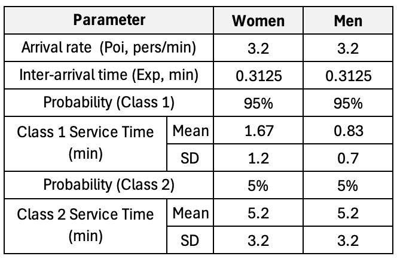
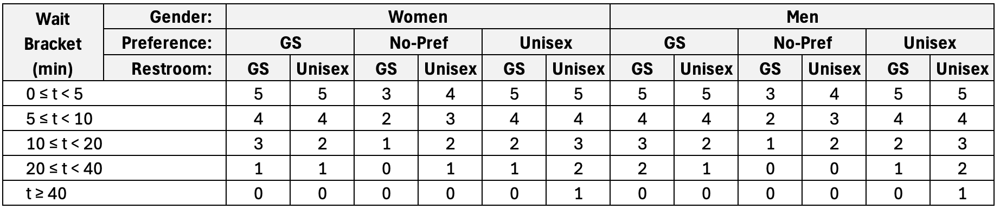
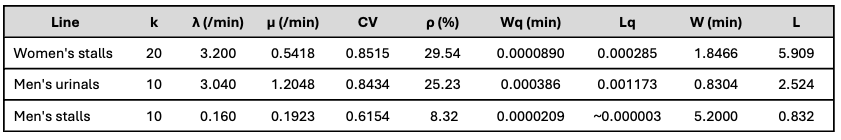
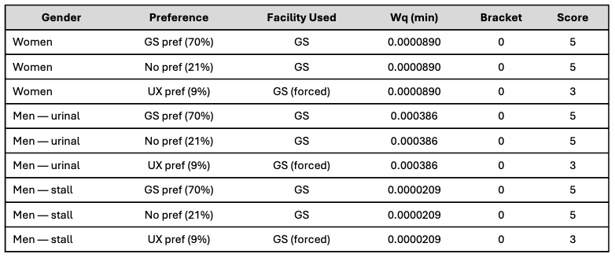
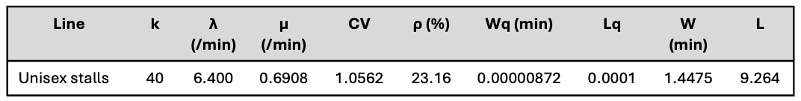
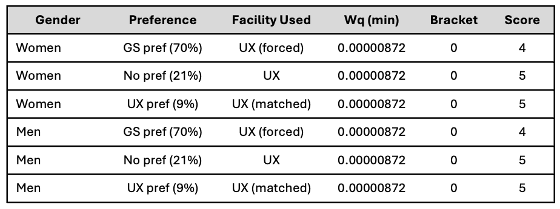
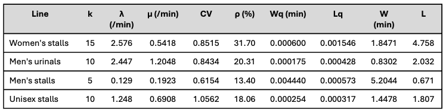
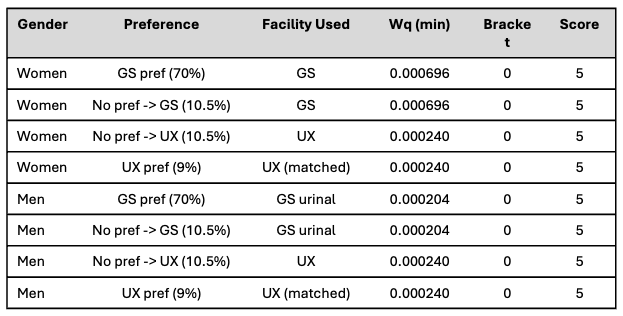

```{r}
#| label: setup
#| include: false

knitr::opts_chunk$set(echo = TRUE, eval=TRUE, error=TRUE, cache=FALSE)
```

\newpage

# 1. Introduction and background

During performances, the concert hall has a strict 25-minute intermission. This short period can create a sudden rush to restroom facilities and cause serious congestion. Management has received increasing complaints about long waiting times and the lack of inclusive restroom design. Therefore, this problem is not only about reducing queues, but also about improving fairness and accessibility for different users.

Historical observations show that restroom users do not all behave in the same way. Users can have different service-time needs and different preferences for restroom types. Some users prefer gender-segregated facilities, some have no strong preference, and some prefer unisex facilities. Because of this, the best restroom design should not only have shorter average waiting times, but should also consider whether different user groups are treated fairly.

This report evaluates three possible restroom configurations: the Status Quo, the All Unisex model, and the Hybrid model. The analysis uses queueing theory to estimate waiting-time performance, simulation to test more realistic intermission conditions, and fairness measures to compare the experience of different user groups.

The three configurations evaluated in this report are:

1.  **Status Quo**: 20 women’s stalls, 10 men’s urinals, and 10 men’s stalls.
2.  **All Unisex**: 40 universal all-gender stalls.
3.  **Hybrid Model**: 15 women’s stalls, 10 men’s urinals, 5 men’s stalls, and 10 unisex stalls.

The aim of this report is to provide management with a clear recommendation about which configuration should be used. The recommended design should reduce congestion during intermission while also supporting a more inclusive restroom system.

# 2. Analytical Methods

# 3. Results

The analysis proceeds in two phases. First, a closed-form analytical model establishes baseline performance metrics and equity scores for each configuration under idealised steady-state conditions. These results are then stress-tested through discrete-event simulation to examine system behaviour under realistic intermission demand patterns.

## 3.1 Model Parameter and Assumptions

Before presenting results, this section summarises the input parameters and modelling assumptions applied consistently across all configurations and scenarios. These values are derived directly from the historical observation data provided in the case.

### 3.1.1 Input Parameters

**Table 1 — Observed Input Parameters**

{fig-align="center" width="449"}

**Table 2 — User Preference Distribution**

| Preference Type        | Proportion |
|:-----------------------|:----------:|
| Gender-segregated (GS) |    70%     |
| No preference (NP)     |    21%     |
| Unisex (UX)            |     9%     |

> Applies equally to both genders and across all configurations.

**Table 3 — User Satisfaction Score Table**



**Table 4 — Configuration Fixture Allocation**

| Restroom Type  | Config 1 | Config 2 | Config 3 |
|:---------------|:--------:|:--------:|:--------:|
| Women's stalls |    20    |    \-    |    15    |
| Men's urinals  |    10    |    \-    |    10    |
| Men's stalls   |    10    |    \-    |    5     |
| Unisex stalls  |    \-    |    40    |    10    |
| **Total**      |  **40**  |  **40**  |  **40**  |

### 3.1.2 Modelling Assumptions

The following assumptions are applied throughout the analysis:

-   Arrivals follow a Poisson process. The concert hall has a fixed total audience capacity, of which a certain proportion are expected to seek restroom access during the intermission, collectively reflected in an aggregate arrival rate of 6.4 pers/min across all genders. Each gender's individual arrival rate is then derived proportionally from this aggregate based on the assumed gender composition of the audience.

-   Service times are treated as a general distribution, characterised by the empirically observed mean and SD from the historical data.

-   For the baseline analysis, no-preference users are assumed to split equally (50-50) between gender-segregated and unisex facilities where available. In the simulation scenarios, this routing rule is replaced by a shortest queue length rule or shortest expected wait time rule, reflecting more realistic decision-making behaviour under congestion.

-   Gender-diverse patrons are acknowledged qualitatively but excluded from quantitative scoring due to the absence of arrival rate data in the historical observations.

-   Steady-state conditions are assumed for the baseline analytical model.

## 3.2 Baseline System Performance

Before presenting results, this section summarises the input parameters and modelling assumptions applied consistently across all configurations and scenarios. These values are derived directly from the historical observation data provided in the case.

### 3.2.1 Configuration 1: Status Quo

**Queuing performance**



**Fairness scores**



|      Metrics      | Score |
|:-----------------:|:-----:|
| Totalitarian (Tr) | 4.82  |
|   Rawlsian (Mr)   |   3   |

### 3.2.2 Configuration 2: All Unisex

**Queuing performance**



**Fairness scores**



|      Metrics      | Score |
|:-----------------:|:-----:|
| Totalitarian (Tr) |  4.3  |
|   Rawlsian (Mr)   |   4   |

### 3.2.3 Configuration 3: Hybrid Model

**Queuing performance**



**Fairness scores**



|      Metrics      | Score |
|:-----------------:|:-----:|
| Totalitarian (Tr) |   5   |
|   Rawlsian (Mr)   |   5   |

### 3.2.4 Comparative Equity Analysis

In general, all configurations perform well in terms of overall average waiting time, with all lines operating well within capacity. It is expected since this is a baseline analysis under idealised steady-state conditions, where the system is not stressed by burst arrivals or high service-time variability. The M/G/k model is applied to all configurations using the pooled WAST parameters. Results show all systems are well within capacity (ρ \< 35% across all lines), with near-zero wait times.

However, the fairness scores reveal important differences in how each configuration serves different user groups. Across the three configurations, the equity scores can be summarised as follows:

|        Metric         | Config 1 | Config 2 | Config 3 |
|:---------------------:|:--------:|:--------:|:--------:|
| **Totalitarian (Tr)** |   4.82   |   4.30   |  **5**   |
|   **Rawlsian (Mr)**   |    3     |    4     |  **5**   |

Under these conditions, the fairness scores are driven entirely by access and preference match rather than wait times. Config 3 achieves perfect Tr and Mr. Config 2 with Unisex only restrooms has a lower Tr due to the lower satisfaction scores for gender-segregated preference users (majority), but a higher Mr than Config 1 because it provides better access for unisex-preference users. Config 1 has a higher Tr than Config 2 because it provides better access for the majority gender-segregated preference users, but a lower Mr than Config 2 because it provides no access for unisex-preference users.

Based on the resulted equity scores, the configurations can be ranked as follows:

-   Totalitarian ranking: Config 3 \> Config 1 \> Config 2

-   Rawlsian ranking: Config 3 \> Config 2 \> Config 1

While the baseline results establish a clear ranking under idealised conditions, real concert hall intermissions rarely conform to steady-state assumptions. Patrons tend to surge toward restrooms immediately after the performance pauses, or rush back just before it resumes. The following section examines whether the baseline ranking holds under these more realistic demand patterns.

## 3.3 System Behaviour Under Surge Demand

Four surge scenarios are simulated to stress-test the baseline findings. All scenarios apply a burst arrival pattern where 80% of patrons arrive within a concentrated 5-minute window, with the remaining 20% spread across the rest of the intermission. Two timing variants are tested, early burst (first 5 minutes) and late burst (last 5 minutes), each combined with two gender compositions: male-dominated and female-dominated arrivals.

The gender composition scenarios reflect a practical reality of concert hall operations: audience demographics are not always balanced and are often shaped by the nature of the performance. A K-pop or idol group concert, for instance, typically attracts a predominantly female audience, while other genres may skew male. Rather than assuming a 50-50 gender split, these scenarios examine how each configuration performs when one gender accounts for 80% of total arrivals, capturing the service time variance and diverse stakeholder needs that arise from such demographic shifts.

This stress test approach uses the pareto principle to create a more extreme scenario, where the majority of demand is concentrated in a short time window, and one gender dominates the arrivals. This allows us to evaluate the robustness of each configuration under conditions that are more challenging than the baseline steady-state scenario, and to see how well they can accommodate different user groups when demand is highly concentrated.

|   | Early Burst (first 5 min) | Late Burst (last 5 min) |
|----|----|----|
| **Male-Dominant (80% Men)** | Scenario 1 | Scenario 3 |
| **Female-Dominant (80% Women)** | Scenario 2 | Scenario 4 |

### 3.3.1 Early Surge with Male-Dominated Arrivals

### 3.3.2 Early Surge with Female-Dominated Arrivals

### 3.3.3 Late Surge with Male-Dominated Arrivals

### 3.3.4 Late Surge with Female-Dominated Arrivals

## 3.4 Comparative Equity Analysis Under Surge Demand

### 3.4.1 Operational performance across surge scenarios

### 3.4.2 Fairness and equity scores under various surge scenarios

### 3.4.3 Overall ranking and robustness analysis

Average waiting time by configuration: bar chart

Women vs men waiting time: gender disparity

Worst-group waiting time by configuration: Direction A。

Equity score comparison: preference table into equity scores

Burst arrival results: table or line chart eg. queue length over time or users still waiting after 25 minutes

Apply a fairness feasibility threshold: a configuration is considered unacceptable if any stakeholder group has an average waiting time greater than 15 minutes, because this represents more than half of the 25-minute intermission and would leave insufficient time for patrons to return comfortably before the performance resumes.

-   Primary threshold: any group average wait \> 15 minutes is unacceptable.
-   Secondary stress indicator: if many users remain unserved after 25 minutes, the configuration is not robust.

*threshold can be adjusted, now just for example*

# 4. Discussions of results and business recommendation

# 5. Conclusion and further suggested work


**NOT FINALISED**

1.  Introduction and Background

    1.1 Business problem: 25-minute intermission and restroom congestion

    During performances, the concert hall has a strict 25-minute intermission. This short period creates a sudden rush to restroom facilities, leading to congestion and long waiting times. Management has received increasing complaints not only about queue length, but also about the lack of inclusive restroom design.

    1.2 Why this is also a fairness and inclusivity problem

    Different users have different needs and preferences. Some prefer gender-segregated facilities, some have no strong preference, and some prefer unisex facilities. Because of this, the best restroom design should not only have shorter average waiting times, but should also consider whether different user groups are treated fairly.

    1.3 Report scope: Primary Direction A + secondary Direction B

    This report focuses primarily on **Direction A: Fairness and Stakeholder Disparity**. The three baseline configurations are compared using both waiting-time performance (Totalitarian) and preference-based equity measures (Rawlsian). As a secondary sensitivity analysis, the report also considers **Direction B: Splitting Rules**, by examining how different assumptions about no-preference users may affect the results.

    1.4 Three configurations compared

    The three configurations evaluated in this report are:

    1.  **Status Quo**: 20 women’s stalls, 10 men’s urinals, and 10 men’s stalls.
    2.  **All Unisex**: 40 universal all-gender stalls.
    3.  **Hybrid Model**: 15 women’s stalls, 10 men’s urinals, 5 men’s stalls, and 10 unisex stalls.

    *(If we decide to include Direction C, we can add it here and in the analysis sections below.)*

2.  Analytical Methods

    2.1 Queueing model assumptions

    -   Poisson arrivals
    -   Non-Exponential / variable service times
    -   Multi-server queues

    2.2 Input parameters and stakeholder groups

| Stakeholder | Meaning |
|---------------------------------|---------------------------------------|
| Women, gender-segregated preference | Prefer women’s facilities |
| Men, gender-segregated preference | Prefer men’s facilities |
| No-preference users | Can use either gender-segregated or unisex |
| Unisex-preference users | Prefer unisex facilities |
| Class 1 users | Shorter service time |
| Class 2 users | Longer service time |

2.3 Direction A fairness framework

```         
  - Average wait: Efficiency
  - Group wait: Stakeholder disparity
  - Worst-group wait: Rawlsian fairness
  - Equity score: Inclusive design / user satisfaction
  - Difference between longest and shortest group wait: Inequality / disparity
  - Totalitarian vs Rawlsian approach
    - Totalitarian criterion: Which configuration gives the highest total welfare or lowest overall average waiting time?
    - Rawlsian criterion: Which configuration minimises the worst stakeholder waiting time or improves the lowest equity score?
```

2.4 Direction B splitting rule sensitivity

```         
  Focus on how no-preference users are split between gender-segregated and unisex facilities, several alternative splitting rules:
  - Baseline fixed split: No-preference users are assumed to be randomly split 50/50 between gender-segregated and unisex facilities.
  - More GS-oriented split: No-preference users mostly follow gender-segregated facilities
  - More unisex-oriented split: No-preference users more willing to use unisex facilities
  - Shortest queue rule: No-preference users choose the shorter queue at the time of arrival
  - Shortest expected wait rule: No-preference users choose the option with lower expected waiting time

Assumption: We only apply adaptive splitting to no-preference users, while gender-segregated preference and unisex-preference users mainly follow their stated preferences.
```

2.5 Simulation scenarios

The simulation is used to test whether the analytical queueing results remain reliable under more realistic intermission conditions. In particular, the simulation considers three scenarios: - Baseline: Based on the historical arrival and service-time parameters provided in the case, the simulation assumes that arrivals follow the baseline stochastic process and that users follow the initial splitting rule. (As the normal intermission scenario to think which configuration performs best under typical conditions.) - Burst arrival: 80% arrive in first 5 minutes (To stress-test the restroom system under a realistic intermission rush scenario, where many users arrive at the same time. Which configuration is most robust when demand is highly concentrated at the beginning of the intermission?) - Higher service-time variance: The baseline service-time distribution may underestimate the diversity of user needs. Some users may require more time due to accessibility needs, caregiving responsibilities, clothing, mobility limitations, or other personal factors. Therefore, this scenario increases the variability of service times while keeping the same basic arrival structure. (To test whether the recommended configuration remains fair when service times are more unequal. Which configuration is less sensitive to service-time variability?) \<- Important for fairness because a system that only works well when most users have short service times may not be inclusive.

```         
Metric:

mean wait - Average waiting time across users: overall efficiency
median wait - Typical user's wating time: less sensitive to outliers than mean
90th percentile wait - Waiting time experienced by the worst 10% of users: measures fairness and congestion risk
maximum wait - Longest waiting time experienced by any user: extreme congestion risk
**percentage of users served within 25 minutes** - percentage of users who complete restroom use during intermission: measures whether the system can handle demand within the time constraints of the intermission
number of users still waiting at end of intermission - Number of users not served before performance resumes: operational failure
```


```         
3.2 Analytical waiting-time results

3.3 Simulation results

3.4 Fairness and equity-score results

3.5 Burst-arrival stress test

3.6 Direction B sensitivity results

Average waiting time by configuration: bar chart

Women vs men waiting time: gender disparity

Worst-group waiting time by configuration: Direction A。

Equity score comparison: preference table into equity scores

Burst arrival results: table or line chart eg. queue length over time or users still waiting after 25 minutes

Apply a fairness feasibility threshold: a configuration is considered unacceptable if any stakeholder group has an average waiting time greater than 15 minutes, because this represents more than half of the 25-minute intermission and would leave insufficient time for patrons to return comfortably before the performance resumes.

-   Primary threshold: any group average wait \> 15 minutes is unacceptable.
-   Secondary stress indicator: if many users remain unserved after 25 minutes, the configuration is not robust.

*threshold can be adjusted, now just for example*
```

4.  Discussion and Business Recommendation (Example)

    4.1 Efficiency comparison

    In terms of overall average waiting time, Configuration X performs best, followed by Configuration Y and Z.

    4.2 Fairness comparison

    Although a configuration may be efficient on average, it may still be unacceptable if one stakeholder group experiences a substantially longer waiting time.

    4.3 Apply decision threshold - Reject configurations where any group average wait \> 15 minutes

| Criterion    | Meaning                                               |
|--------------|-------------------------------------------------------|
| Efficiency   | Overall average wait should be low                    |
| Fairness     | Worst-group wait should not exceed threshold          |
| Inclusivity  | Unisex-preference users should have reasonable access |
| Robustness   | Performance should not collapse under burst arrival   |
| Practicality | Configuration should be operationally feasible        |

If a configuration has a lowest avg waiting time, but one group has an average wait of 15 minutes, it would be rejected based on the fairness criterion. If a configuration considered as fair but collapses under burst arrival, it would be rejected based on the robustness criterion. If a configuration is efficient and fair, but has no unisex access, it would be rejected based on the inclusivity criterion. The final recommendation should be the configuration that best balances these criteria.

4.4 Discuss inclusivity and unisex access

Unisex facilities provide flexibility and support inclusive access, especially for users who prefer or require all-gender facilities. However, if unisex capacity is too small, these users may experience long queues and low equity scores. Therefore, the recommendation should consider both the number of unisex units and how users are directed to them during peak demand.

The conclusion is also tested under alternative splitting rules. If no-preference users are willing to move toward the shorter queue, the Hybrid Model may perform better because unisex stalls can absorb overflow demand. However, this depends on clear signage and user awareness.

4.5 Recommend final configuration

4.6 Explain why other options are not selected

What does it mean for management, and what should they do?

5.  Conclusion and Further Suggested Work: Summarise final recommendation and acknowledge limitations.

    5.1 Final summary of recommendation

    Based on the combined evaluation of waiting-time performance, stakeholder disparity, equity scores, and burst-arrival robustness, this report recommends **Configuration X** as the preferred design. The optimal configuration does not mean it is perfect in every aspect, but it avoids having any stakeholder group experiencing an average wait time greater than 15 minutes, while also providing reasonable access for unisex-preference users and maintaining robustness under burst arrival conditions.

    5.2 Main limitations

    5.3 Further work - More real data: Improve accuracy of arrival assumptions - Cost analysis: Assess feasibility of redesign - Different event types: Audience behaviour may differ by concert type - More behavioural split rules: Better represent real user decisions - Accessibility and sustainability considerations: Consider how design affects users with disabilities and environmental impact of different configurations

6.  Appendix

    -   Code
    -   Full simulation details
    -   Extra tables/figures
    -   References


\newpage

Simulation
burst in last 5 minutes while 80% arrive is women

Sevice time variance increase by class 2 probability increase from 0.05 to 0.5

```{r}
#| label: setup-and-parameters
#| include: false

library(tidyverse)
library(knitr)

seed1 <- 123
n_rep <- 500
intermission_length <- 25

# -----------------------------
# Case parameters
# -----------------------------

intermission_length <- 25

# Historical arrival rates
lambda_women <- 3.2
lambda_men <- 3.2

# Preference proportions
pref_GS <- 0.70
pref_NP <- 0.21
pref_UX <- 0.09

# Class 2 probability
prob_class2 <- 0.05

# Service time parameters
service_mean_women_class1 <- 1.67
service_sd_women_class1 <- 1.2

service_mean_women_class2 <- 5.2
service_sd_women_class2 <- 3.2

service_mean_men_class1 <- 0.833
service_sd_men_class1 <- 0.7

service_mean_men_class2 <- 5.2
service_sd_men_class2 <- 3.2


# -----------------------------
# Preference score table
# -----------------------------

score_table <- data.frame(
  wait = c(
    rep(0, 12), rep(5, 12), rep(10, 12), rep(20, 12), rep(40, 12)
  ),
  gender = c(
    "W","W","W","W","W","W","M","M","M","M","M","M",
    "W","W","W","W","W","W","M","M","M","M","M","M",
    "W","W","W","W","W","W","M","M","M","M","M","M",
    "W","W","W","W","W","W","M","M","M","M","M","M",
    "W","W","W","W","W","W","M","M","M","M","M","M"
  ),
  pref = c(
    "GS","GS","NP","NP","UX","UX","GS","GS","NP","NP","UX","UX",
    "GS","GS","NP","NP","UX","UX","GS","GS","NP","NP","UX","UX",
    "GS","GS","NP","NP","UX","UX","GS","GS","NP","NP","UX","UX",
    "GS","GS","NP","NP","UX","UX","GS","GS","NP","NP","UX","UX",
    "GS","GS","NP","NP","UX","UX","GS","GS","NP","NP","UX","UX"
  ),
  uses = c(
    "GS","UX","GS","UX","GS","UX","GS","UX","GS","UX","GS","UX",
    "GS","UX","GS","UX","GS","UX","GS","UX","GS","UX","GS","UX",
    "GS","UX","GS","UX","GS","UX","GS","UX","GS","UX","GS","UX",
    "GS","UX","GS","UX","GS","UX","GS","UX","GS","UX","GS","UX",
    "GS","UX","GS","UX","GS","UX","GS","UX","GS","UX","GS","UX"
  ),
  score = c(
    5,4,5,5,3,5,5,4,5,5,3,5,
    4,3,4,4,2,4,4,3,4,4,2,4,
    3,2,2,2,1,3,3,2,2,2,1,3,
    1,1,1,1,0,2,2,0,1,1,0,2,
    0,0,0,0,0,1,0,0,0,0,0,1
  )
)
```

```{r}
#| label: model-and-simulation-functions
#| include: false

# ============================================================
# Basic helper functions
# ============================================================

rnorm_positive <- function(n, mean, sd) {
  x <- rnorm(n, mean = mean, sd = sd)
  
  while (any(x <= 0)) {
    x[x <= 0] <- rnorm(sum(x <= 0), mean = mean, sd = sd)
  }
  
  return(x)
}


WAST_computation_general <- function(n, sigma, AST) {
  total_N <- sum(n)
  p_all <- sum(n * AST) / total_N
  
  variance_terms <- n * (sigma^2 + (AST - p_all)^2)
  sigma_all <- sqrt(sum(variance_terms) / total_N)
  
  list(mean = p_all, sigma = sigma_all)
}


get_capacity <- function(config) {
  
  if (config == "Status Quo") {
    return(list(
      women_stall = 20,
      men_urinal = 10,
      men_stall = 10,
      unisex = 0
    ))
  }
  
  if (config == "All Unisex") {
    return(list(
      women_stall = 0,
      men_urinal = 0,
      men_stall = 0,
      unisex = 40
    ))
  }
  
  if (config == "Hybrid") {
    return(list(
      women_stall = 15,
      men_urinal = 10,
      men_stall = 5,
      unisex = 10
    ))
  }
  
  stop("Unknown configuration")
}


# ============================================================
# Stage 1: M/G/k analytical model
# This follows the GGK function style from the workshop.
# M/G/k is obtained by setting cv_arrival = 1.
# ============================================================

calculate_ggk_metrics <- function(arrival_rate, service_rate, k, cv_arrival, cv_service) {
  
  rho <- arrival_rate / (k * service_rate)
  
  if (rho >= 1) {
    return(tibble(
      utilization = rho,
      prob_wait = NA_real_,
      Lq = NA_real_,
      L = NA_real_,
      Wq = NA_real_,
      W = NA_real_,
      status = "Unstable"
    ))
  }
  
  E_s <- 1 / service_rate
  prob_wait <- rho^(sqrt(2 * (k + 1)) - 1)
  
  ca_sq <- cv_arrival^2
  cs_sq <- cv_service^2
  
  Wq <- ((ca_sq + cs_sq) / 2) *
    (prob_wait / (k * (1 - rho))) * E_s
  
  W <- Wq + E_s
  Lq <- arrival_rate * Wq
  L <- arrival_rate * W
  
  tibble(
    utilization = rho,
    prob_wait = prob_wait,
    Lq = Lq,
    L = L,
    Wq = Wq,
    W = W,
    status = "Stable"
  )
}


mgk_row <- function(configuration, facility, arrival_rate, k,
                    component_rates, component_sigmas, component_means) {
  
  service <- WAST_computation_general(
    n = component_rates,
    sigma = component_sigmas,
    AST = component_means
  )
  
  bind_cols(
    tibble(
      configuration = configuration,
      facility = facility,
      arrival_rate = arrival_rate,
      servers = k,
      service_mean = service$mean,
      service_sigma = service$sigma
    ),
    calculate_ggk_metrics(
      arrival_rate = arrival_rate,
      service_rate = 1 / service$mean,
      k = k,
      cv_arrival = 1,
      cv_service = service$sigma / service$mean
    )
  )
}


run_mgk_analysis <- function(np_to_gs = 0.5) {
  
  # Baseline class-specific arrival rates
  arrival_women_class1 <- lambda_women * (1 - prob_class2)
  arrival_women_class2 <- lambda_women * prob_class2
  
  arrival_men_class1 <- lambda_men * (1 - prob_class2)
  arrival_men_class2 <- lambda_men * prob_class2
  
  # Hybrid split rates
  women_gs_rate <- lambda_women * (pref_GS + pref_NP * np_to_gs)
  men_gs_rate <- lambda_men * (pref_GS + pref_NP * np_to_gs)
  
  women_ux_rate <- lambda_women * (pref_UX + pref_NP * (1 - np_to_gs))
  men_ux_rate <- lambda_men * (pref_UX + pref_NP * (1 - np_to_gs))
  
  bind_rows(
    # Status Quo
    mgk_row(
      configuration = "Status Quo",
      facility = "Women stalls",
      arrival_rate = lambda_women,
      k = 20,
      component_rates = c(arrival_women_class1, arrival_women_class2),
      component_sigmas = c(service_sd_women_class1, service_sd_women_class2),
      component_means = c(service_mean_women_class1, service_mean_women_class2)
    ),
    
    mgk_row(
      configuration = "Status Quo",
      facility = "Men urinals",
      arrival_rate = arrival_men_class1,
      k = 10,
      component_rates = c(arrival_men_class1),
      component_sigmas = c(service_sd_men_class1),
      component_means = c(service_mean_men_class1)
    ),
    
    mgk_row(
      configuration = "Status Quo",
      facility = "Men stalls",
      arrival_rate = arrival_men_class2,
      k = 10,
      component_rates = c(arrival_men_class2),
      component_sigmas = c(service_sd_men_class2),
      component_means = c(service_mean_men_class2)
    ),
    
    # All Unisex
    mgk_row(
      configuration = "All Unisex",
      facility = "Unisex",
      arrival_rate = lambda_women + lambda_men,
      k = 40,
      component_rates = c(
        arrival_women_class1,
        arrival_women_class2,
        arrival_men_class1,
        arrival_men_class2
      ),
      component_sigmas = c(
        service_sd_women_class1,
        service_sd_women_class2,
        service_sd_men_class1,
        service_sd_men_class2
      ),
      component_means = c(
        service_mean_women_class1,
        service_mean_women_class2,
        service_mean_men_class1,
        service_mean_men_class2
      )
    ),
    
    # Hybrid
    mgk_row(
      configuration = "Hybrid",
      facility = "Women stalls",
      arrival_rate = women_gs_rate,
      k = 15,
      component_rates = c(
        women_gs_rate * (1 - prob_class2),
        women_gs_rate * prob_class2
      ),
      component_sigmas = c(service_sd_women_class1, service_sd_women_class2),
      component_means = c(service_mean_women_class1, service_mean_women_class2)
    ),
    
    mgk_row(
      configuration = "Hybrid",
      facility = "Men urinals",
      arrival_rate = men_gs_rate * (1 - prob_class2),
      k = 10,
      component_rates = c(men_gs_rate * (1 - prob_class2)),
      component_sigmas = c(service_sd_men_class1),
      component_means = c(service_mean_men_class1)
    ),
    
    mgk_row(
      configuration = "Hybrid",
      facility = "Men stalls",
      arrival_rate = men_gs_rate * prob_class2,
      k = 5,
      component_rates = c(men_gs_rate * prob_class2),
      component_sigmas = c(service_sd_men_class2),
      component_means = c(service_mean_men_class2)
    ),
    
    mgk_row(
      configuration = "Hybrid",
      facility = "Unisex",
      arrival_rate = women_ux_rate + men_ux_rate,
      k = 10,
      component_rates = c(
        women_ux_rate * (1 - prob_class2),
        women_ux_rate * prob_class2,
        men_ux_rate * (1 - prob_class2),
        men_ux_rate * prob_class2
      ),
      component_sigmas = c(
        service_sd_women_class1,
        service_sd_women_class2,
        service_sd_men_class1,
        service_sd_men_class2
      ),
      component_means = c(
        service_mean_women_class1,
        service_mean_women_class2,
        service_mean_men_class1,
        service_mean_men_class2
      )
    )
  )
}


# ============================================================
# Stage 2: simulation functions
# ============================================================

generate_stage2_users <- function(rep_id, scenario, arrival_pattern, prob_class2_scenario) {
  
  set.seed(seed1 + rep_id)
  
  n_users <- round((lambda_women + lambda_men) * intermission_length)
  
  if (arrival_pattern == "burst") {
    
    # 80% arrive in the final 5 minutes
    n_late <- round(0.80 * n_users)
    n_early <- n_users - n_late
    
    arrival_time <- c(
      runif(n_early, min = 0, max = 20),
      runif(n_late, min = 20, max = 25)
    )
    
    arrival_period <- c(rep("early", n_early), rep("late", n_late))
    
    gender <- c(
      sample(c("W", "M"), n_early, replace = TRUE, prob = c(0.5, 0.5)),
      sample(c("W", "M"), n_late, replace = TRUE, prob = c(0.8, 0.2))
    )
  }
  
  if (arrival_pattern == "baseline") {
    
    arrival_time <- runif(n_users, min = 0, max = intermission_length)
    arrival_period <- rep("baseline", n_users)
    
    gender <- sample(
      c("W", "M"),
      n_users,
      replace = TRUE,
      prob = c(0.5, 0.5)
    )
  }
  
  service_class <- sample(
    c("class1", "class2"),
    n_users,
    replace = TRUE,
    prob = c(1 - prob_class2_scenario, prob_class2_scenario)
  )
  
  preference <- sample(
    c("GS", "NP", "UX"),
    n_users,
    replace = TRUE,
    prob = c(pref_GS, pref_NP, pref_UX)
  )
  
  service_time <- numeric(n_users)
  
  for (i in 1:n_users) {
    
    if (gender[i] == "W" & service_class[i] == "class1") {
      service_time[i] <- rnorm_positive(
        1,
        service_mean_women_class1,
        service_sd_women_class1
      )
    }
    
    if (gender[i] == "W" & service_class[i] == "class2") {
      service_time[i] <- rnorm_positive(
        1,
        service_mean_women_class2,
        service_sd_women_class2
      )
    }
    
    if (gender[i] == "M" & service_class[i] == "class1") {
      service_time[i] <- rnorm_positive(
        1,
        service_mean_men_class1,
        service_sd_men_class1
      )
    }
    
    if (gender[i] == "M" & service_class[i] == "class2") {
      service_time[i] <- rnorm_positive(
        1,
        service_mean_men_class2,
        service_sd_men_class2
      )
    }
  }
  
  tibble(
    rep = rep_id,
    scenario = scenario,
    id = 1:n_users,
    arrival_time = arrival_time,
    arrival_period = arrival_period,
    gender = gender,
    service_class = service_class,
    preference = preference,
    service_time = service_time
  ) |>
    arrange(arrival_time)
}


assign_facility <- function(users, config, np_to_gs = 0.5) {
  
  users$facility <- NA
  
  if (config == "Status Quo") {
    users$facility[users$gender == "W"] <- "women_stall"
    users$facility[users$gender == "M" & users$service_class == "class1"] <- "men_urinal"
    users$facility[users$gender == "M" & users$service_class == "class2"] <- "men_stall"
  }
  
  if (config == "All Unisex") {
    users$facility <- "unisex"
  }
  
  if (config == "Hybrid") {
    
    users$facility[users$gender == "W" & users$preference == "GS"] <- "women_stall"
    users$facility[users$gender == "M" & users$preference == "GS" & users$service_class == "class1"] <- "men_urinal"
    users$facility[users$gender == "M" & users$preference == "GS" & users$service_class == "class2"] <- "men_stall"
    
    users$facility[users$preference == "UX"] <- "unisex"
    
    is_np <- users$preference == "NP"
    go_to_gs <- runif(nrow(users)) < np_to_gs
    
    users$facility[users$gender == "W" & is_np & go_to_gs] <- "women_stall"
    users$facility[users$gender == "W" & is_np & !go_to_gs] <- "unisex"
    
    users$facility[users$gender == "M" & is_np & go_to_gs & users$service_class == "class1"] <- "men_urinal"
    users$facility[users$gender == "M" & is_np & go_to_gs & users$service_class == "class2"] <- "men_stall"
    users$facility[users$gender == "M" & is_np & !go_to_gs] <- "unisex"
  }
  
  return(users)
}


simulate_queue <- function(queue_data, k) {
  
  queue_data <- queue_data |>
    arrange(arrival_time)
  
  n <- nrow(queue_data)
  server_available <- rep(0, k)
  
  start_time <- numeric(n)
  completion_time <- numeric(n)
  
  for (i in 1:n) {
    
    next_server <- which.min(server_available)
    
    start_time[i] <- max(queue_data$arrival_time[i], server_available[next_server])
    completion_time[i] <- start_time[i] + queue_data$service_time[i]
    
    server_available[next_server] <- completion_time[i]
  }
  
  queue_data |>
    mutate(
      start_time = start_time,
      completion_time = completion_time,
      waiting_time = start_time - arrival_time,
      system_time = completion_time - arrival_time
    )
}


simulate_config <- function(users, config, np_to_gs = 0.5) {
  
  users_routed <- assign_facility(users, config, np_to_gs)
  cap <- get_capacity(config)
  
  map_dfr(names(cap), function(fac) {
    
    fac_data <- users_routed |>
      filter(facility == fac)
    
    if (nrow(fac_data) == 0 || cap[[fac]] == 0) {
      return(NULL)
    }
    
    simulate_queue(fac_data, k = cap[[fac]])
    
  }) |>
    mutate(configuration = config)
}


run_all_configurations <- function(users, np_to_gs = 0.5) {
  
  c("Status Quo", "All Unisex", "Hybrid") |>
    map_dfr(~ simulate_config(users, config = .x, np_to_gs = np_to_gs))
}


add_preference_score <- function(results) {
  
  results |>
    mutate(
      uses = ifelse(facility == "unisex", "UX", "GS"),
      
      wait = case_when(
        waiting_time >= 40 ~ 40,
        waiting_time >= 20 ~ 20,
        waiting_time >= 10 ~ 10,
        waiting_time >= 5 ~ 5,
        TRUE ~ 0
      )
    ) |>
    left_join(
      score_table,
      by = c("wait", "gender", "preference" = "pref", "uses")
    )
}


summarise_one_rep <- function(results) {
  
  efficiency <- results |>
    group_by(rep, scenario, configuration) |>
    summarise(
      mean_wait = mean(waiting_time),
      p90_wait = as.numeric(quantile(waiting_time, 0.90)),
      mean_system_time = mean(system_time),
      pct_completed_within_25 = mean(completion_time <= 25) * 100,
      n_still_in_system_at_25 = sum(completion_time > 25),
      .groups = "drop"
    )
  
  scored <- add_preference_score(results)
  
  score_overall <- scored |>
  group_by(rep, scenario, configuration) |>
  summarise(
    totalitarian_score = mean(score, na.rm = TRUE),
    .groups = "drop"
  )
  
  score_worst <- scored |>
  group_by(rep, scenario, configuration, preference) |>
  summarise(
    preference_group_score = mean(score, na.rm = TRUE),
    .groups = "drop"
  ) |>
  group_by(rep, scenario, configuration) |>
  summarise(
    rawlsian_score = min(preference_group_score),
    .groups = "drop"
  )
  
  efficiency |>
    left_join(score_overall, by = c("rep", "scenario", "configuration")) |>
    left_join(score_worst, by = c("rep", "scenario", "configuration"))
}


run_one_replication <- function(rep_id, np_to_gs = 0.5) {
  
  users_burst <- generate_stage2_users(
    rep_id = rep_id,
    scenario = "Burst arrival",
    arrival_pattern = "burst",
    prob_class2_scenario = 0.05
  )
  
  users_diverse <- generate_stage2_users(
    rep_id = rep_id + 10000,
    scenario = "Diverse service needs",
    arrival_pattern = "baseline",
    prob_class2_scenario = 0.50
  )
  
  results <- bind_rows(
    run_all_configurations(users_burst, np_to_gs = np_to_gs),
    run_all_configurations(users_diverse, np_to_gs = np_to_gs)
  )
  
  summarise_one_rep(results)
}
```

```{r}
#| label: run-analysis
#| include: false

# -----------------------------
# Stage 1: M/G/k analytical model
# -----------------------------

mgk_results <- run_mgk_analysis(np_to_gs = 0.5)


# -----------------------------
# Stage 2: simulation stress tests
# -----------------------------

stage2_rep_results <- map_dfr(
  1:n_rep,
  ~ run_one_replication(rep_id = .x, np_to_gs = 0.5)
)

stage2_summary <- stage2_rep_results |>
  group_by(scenario, configuration) |>
  summarise(
    mean_wait = mean(mean_wait),
    p90_wait = mean(p90_wait),
    mean_system_time = mean(mean_system_time),
    pct_completed_within_25 = mean(pct_completed_within_25),
    n_still_in_system_at_25 = mean(n_still_in_system_at_25),
    totalitarian_score = mean(totalitarian_score),
    rawlsian_score = mean(rawlsian_score),
    .groups = "drop"
  ) |>
  group_by(scenario) |>
  mutate(
    totalitarian_rank = rank(-totalitarian_score, ties.method = "min"),
    rawlsian_rank = rank(-rawlsian_score, ties.method = "min")
  ) |>
  ungroup()
```

```{r}
#| label: tbl-mgk-results
#| echo: false

mgk_results |>
  select(
    Configuration = configuration,
    Facility = facility,
    `Arrival rate` = arrival_rate,
    Servers = servers,
    Utilisation = utilization,
    `Pr(wait)` = prob_wait,
    `Wq (min)` = Wq,
    `W (min)` = W,
    Status = status
  ) |>
  mutate(
    across(where(is.numeric), ~ round(.x, 4))
  ) |>
  kable(
    caption = "Stage 1 M/G/k analytical queueing results",
    booktabs = TRUE
  )
```

```{r}
#| label: tbl-stage2-burst
#| echo: false

stage2_summary |>
  filter(scenario == "Burst arrival") |>
  select(
    Configuration = configuration,
    `Mean wait (min)` = mean_wait,
    `P90 wait (min)` = p90_wait,
    `Mean system time (min)` = mean_system_time,
    `Completed within 25 min (%)` = pct_completed_within_25,
    `Still in system at 25 min` = n_still_in_system_at_25,
    `Totalitarian score` = totalitarian_score,
    `Rawlsian score` = rawlsian_score,
    `Totalitarian rank` = totalitarian_rank,
    `Rawlsian rank` = rawlsian_rank
  ) |>
  mutate(
    across(where(is.numeric), ~ round(.x, 3))
  ) |>
  kable(
    caption = "Stage 2 stress test: burst-arrival scenario, averaged over 500 simulation replications",
    booktabs = TRUE
  )
```

```{r}
#| label: tbl-stage2-diverse-service-needs
#| echo: false

stage2_summary |>
  filter(scenario == "Diverse service needs") |>
  select(
    Configuration = configuration,
    `Mean wait (min)` = mean_wait,
    `P90 wait (min)` = p90_wait,
    `Mean system time (min)` = mean_system_time,
    `Completed within 25 min (%)` = pct_completed_within_25,
    `Still in system at 25 min` = n_still_in_system_at_25,
    `Totalitarian score` = totalitarian_score,
    `Rawlsian score` = rawlsian_score,
    `Totalitarian rank` = totalitarian_rank,
    `Rawlsian rank` = rawlsian_rank
  ) |>
  mutate(
    across(where(is.numeric), ~ round(.x, 3))
  ) |>
  kable(
    caption = "Stage 2 stress test: diverse service-needs scenario under Totalitarian and Rawlsian approaches, averaged over 500 simulation replications",
    booktabs = TRUE
  )
```

```{r}
#| label: fig-burst-mean-wait
#| echo: false
#| fig-cap: "Mean waiting time under the burst-arrival stress test, averaged over 500 simulation replications."

stage2_summary |>
  filter(scenario == "Burst arrival") |>
  ggplot(aes(x = configuration, y = mean_wait, fill = configuration)) +
  geom_col(width = 0.75) +
  geom_text(
    aes(label = sprintf("%.2f", mean_wait)),
    vjust = -0.3,
    size = 3
  ) +
  labs(
    x = "Configuration",
    y = "Mean waiting time (minutes)",
    title = "Mean Waiting Time under Burst Arrival"
  ) +
  expand_limits(
    y = max(stage2_summary$mean_wait[stage2_summary$scenario == "Burst arrival"]) * 1.15
  ) +
  theme_minimal() +
  theme(legend.position = "none")
```

```{r}
#| label: fig-burst-completion
#| echo: false
#| fig-cap: "Percentage of users completing restroom use within the 25-minute intermission under the burst-arrival stress test."

stage2_summary |>
  filter(scenario == "Burst arrival") |>
  ggplot(aes(x = configuration, y = pct_completed_within_25, fill = configuration)) +
  geom_col(width = 0.75) +
  geom_text(
    aes(label = sprintf("%.1f%%", pct_completed_within_25)),
    vjust = -0.3,
    size = 3
  ) +
  labs(
    x = "Configuration",
    y = "Completed within 25 minutes (%)",
    title = "Completion Rate under Burst Arrival"
  ) +
  expand_limits(y = 100) +
  theme_minimal() +
  theme(legend.position = "none")
```

```{r}
#| label: fig-burst-totalitarian-rawlsian
#| echo: false
#| fig-cap: "Totalitarian and Rawlsian preference scores under the burst-arrival stress test."

stage2_summary |>
  filter(scenario == "Burst arrival") |>
  select(
    configuration,
    totalitarian_score,
    rawlsian_score
  ) |>
  pivot_longer(
    cols = c(totalitarian_score, rawlsian_score),
    names_to = "approach",
    values_to = "score"
  ) |>
  mutate(
    approach = recode(
      approach,
      "totalitarian_score" = "Totalitarian",
      "rawlsian_score" = "Rawlsian"
    )
  ) |>
  ggplot(aes(x = configuration, y = score, fill = approach)) +
  geom_col(position = position_dodge(width = 0.8), width = 0.7) +
  geom_text(
    aes(label = sprintf("%.2f", score)),
    position = position_dodge(width = 0.8),
    vjust = -0.3,
    size = 3
  ) +
  labs(
    x = "Configuration",
    y = "Preference score",
    fill = "Approach",
    title = "Totalitarian vs Rawlsian Preference Scores"
  ) +
  expand_limits(y = 5) +
  theme_minimal()
```

```{r}
#| label: fig-diverse-totalitarian-rawlsian
#| echo: false
#| fig-cap: "Totalitarian and Rawlsian preference scores under the diverse service-needs stress test."

stage2_summary |>
  filter(scenario == "Diverse service needs") |>
  select(
    configuration,
    totalitarian_score,
    rawlsian_score
  ) |>
  pivot_longer(
    cols = c(totalitarian_score, rawlsian_score),
    names_to = "approach",
    values_to = "score"
  ) |>
  mutate(
    approach = recode(
      approach,
      "totalitarian_score" = "Totalitarian",
      "rawlsian_score" = "Rawlsian"
    )
  ) |>
  ggplot(aes(x = configuration, y = score, fill = approach)) +
  geom_col(position = position_dodge(width = 0.8), width = 0.7) +
  geom_text(
    aes(label = sprintf("%.2f", score)),
    position = position_dodge(width = 0.8),
    vjust = -0.3,
    size = 3
  ) +
  labs(
    x = "Configuration",
    y = "Preference score",
    fill = "Approach",
    title = "Preference Scores under Diverse Service Needs"
  ) +
  expand_limits(y = 5) +
  theme_minimal()
```


burst in first 5 minutes while 80% arrive is women

```{r}
# ============================================================
# Stage 2 Simulation:
# Female-Dominant Burst + High Service-Time Variance
# ============================================================

library(dplyr)
library(tidyr)
library(ggplot2)

set.seed(123)

# ============================================================
# 1. Main simulation settings
# ============================================================

n_rep <- 500
intermission_length <- 25

# Arrival rate from case:
# Women = 3.2 per minute, Men = 3.2 per minute
total_arrival_rate <- 6.4
expected_users <- total_arrival_rate * intermission_length

configs <- c("Status Quo", "All Unisex", "Hybrid Model")

# Stage 2 scenarios:
# Both scenarios use the same female-dominant burst.
stage2_scenarios <- data.frame(
  scenario = c(
    "Female-dominant burst",
    "Female-dominant burst + high service variance"
  ),
  early_prop = c(0.80, 0.80),
  early_female_prop = c(0.80, 0.80),
  late_female_prop = c(0.50, 0.50),
  service_sd_multiplier = c(1.00, 1.50),
  class2_prob = c(0.05, 0.10)
)

stage2_scenarios

stage2_scenarios$scenario <- factor(
  stage2_scenarios$scenario,
  levels = stage2_scenarios$scenario
)

# ============================================================
# 2. Service-time generator
# ============================================================
# Lognormal service time is used because service time cannot be negative.

r_service_lognormal <- function(n, mean_service, sd_service) {
  sigma2 <- log(1 + (sd_service^2 / mean_service^2))
  sigma <- sqrt(sigma2)
  mu <- log(mean_service) - sigma2 / 2
  
  rlnorm(n, meanlog = mu, sdlog = sigma)
}

# ============================================================
# 3. Generate users for one intermission
# ============================================================

generate_users <- function(
    early_prop,
    early_female_prop,
    late_female_prop,
    service_sd_multiplier,
    class2_prob
) {
  
  # Random total number of restroom users
  N <- rpois(1, lambda = expected_users)
  
  # -----------------------------
  # Arrival times
  # -----------------------------
  
  n_early <- round(N * early_prop)
  n_late <- N - n_early
  
  # 80% arrive in first 5 minutes
  early_arrivals <- runif(n_early, min = 0, max = 5)
  
  # remaining 20% arrive from minute 5 to 25
  late_arrivals <- runif(n_late, min = 5, max = intermission_length)
  
  # -----------------------------
  # Gender mix
  # -----------------------------
  
  early_gender <- sample(
    c("Women", "Men"),
    size = n_early,
    replace = TRUE,
    prob = c(early_female_prop, 1 - early_female_prop)
  )
  
  late_gender <- sample(
    c("Women", "Men"),
    size = n_late,
    replace = TRUE,
    prob = c(late_female_prop, 1 - late_female_prop)
  )
  
  users <- data.frame(
    user_id = 1:N,
    arrival_time = c(early_arrivals, late_arrivals),
    gender = c(early_gender, late_gender)
  )
  
  # -----------------------------
  # Preference type
  # GS = gender-segregated preference
  # NP = no preference
  # UX = unisex preference
  # -----------------------------
  
  users$preference <- sample(
    c("GS", "NP", "UX"),
    size = N,
    replace = TRUE,
    prob = c(0.70, 0.21, 0.09)
  )
  
  # -----------------------------
  # Service class
  # Class 2 users have longer service needs
  # -----------------------------
  
  users$class_type <- sample(
    c("Class 1", "Class 2"),
    size = N,
    replace = TRUE,
    prob = c(1 - class2_prob, class2_prob)
  )
  
  # -----------------------------
  # Service-time parameters
  # -----------------------------
  
  users <- users %>%
    mutate(
      service_mean = case_when(
        gender == "Women" & class_type == "Class 1" ~ 1.67,
        gender == "Men"   & class_type == "Class 1" ~ 0.833,
        class_type == "Class 2" ~ 5.20
      ),
      service_sd = case_when(
        gender == "Women" & class_type == "Class 1" ~ 1.20,
        gender == "Men"   & class_type == "Class 1" ~ 0.70,
        class_type == "Class 2" ~ 3.20
      ),
      service_sd = service_sd * service_sd_multiplier
    )
  
  # Generate random service time
  users$service_time <- mapply(
    r_service_lognormal,
    n = 1,
    mean_service = users$service_mean,
    sd_service = users$service_sd
  )
  
  users <- users %>%
    arrange(arrival_time)
  
  row.names(users) <- NULL
  
  users
}

# ============================================================
# 4. Multi-server queue simulator
# ============================================================
# Each stall or urinal is treated as one server.

simulate_queue_k <- function(arrival_time, service_time, k) {
  
  n <- length(arrival_time)
  next_free <- rep(0, k)
  
  start_time <- numeric(n)
  completion_time <- numeric(n)
  waiting_time <- numeric(n)
  system_time <- numeric(n)
  
  for (i in 1:n) {
    
    server <- which.min(next_free)
    
    start_time[i] <- max(arrival_time[i], next_free[server])
    waiting_time[i] <- start_time[i] - arrival_time[i]
    completion_time[i] <- start_time[i] + service_time[i]
    system_time[i] <- completion_time[i] - arrival_time[i]
    
    next_free[server] <- completion_time[i]
  }
  
  data.frame(
    start_time = start_time,
    completion_time = completion_time,
    waiting_time = waiting_time,
    system_time = system_time
  )
}

# ============================================================
# 5. Assign users to facilities
# ============================================================

assign_facility <- function(users, config_name, np_unisex_prob = 0.50) {
  
  users$facility <- NA
  
  # -----------------------------
  # Status Quo:
  # 20 women's stalls, 10 men's urinals, 10 men's stalls
  # -----------------------------
  
  if (config_name == "Status Quo") {
    
    users$facility[users$gender == "Women"] <- "Women_stalls"
    
    users$facility[
      users$gender == "Men" & users$class_type == "Class 1"
    ] <- "Men_urinals"
    
    users$facility[
      users$gender == "Men" & users$class_type == "Class 2"
    ] <- "Men_stalls"
  }
  
  # -----------------------------
  # All Unisex:
  # 40 universal stalls
  # -----------------------------
  
  if (config_name == "All Unisex") {
    users$facility <- "Unisex_stalls"
  }
  
  # -----------------------------
  # Hybrid Model:
  # 15 women's stalls, 10 men's urinals,
  # 5 men's stalls, 10 unisex stalls
  # -----------------------------
  
  if (config_name == "Hybrid Model") {
    
    # Unisex-preference users
    users$facility[users$preference == "UX"] <- "Unisex_stalls"
    
    # Gender-segregated preference users
    users$facility[
      users$preference == "GS" &
        users$gender == "Women"
    ] <- "Women_stalls"
    
    users$facility[
      users$preference == "GS" &
        users$gender == "Men" &
        users$class_type == "Class 1"
    ] <- "Men_urinals"
    
    users$facility[
      users$preference == "GS" &
        users$gender == "Men" &
        users$class_type == "Class 2"
    ] <- "Men_stalls"
    
    # No-preference users split between gendered and unisex
    np_index <- which(users$preference == "NP")
    go_unisex <- runif(length(np_index)) < np_unisex_prob
    
    users$facility[np_index[go_unisex]] <- "Unisex_stalls"
    
    gendered_np <- np_index[!go_unisex]
    
    users$facility[
      gendered_np[users$gender[gendered_np] == "Women"]
    ] <- "Women_stalls"
    
    users$facility[
      gendered_np[
        users$gender[gendered_np] == "Men" &
          users$class_type[gendered_np] == "Class 1"
      ]
    ] <- "Men_urinals"
    
    users$facility[
      gendered_np[
        users$gender[gendered_np] == "Men" &
          users$class_type[gendered_np] == "Class 2"
      ]
    ] <- "Men_stalls"
  }
  
  users
}

# ============================================================
# 6. Simulate one configuration
# ============================================================

simulate_config <- function(users, config_name, np_unisex_prob = 0.50) {
  
  users <- assign_facility(
    users = users,
    config_name = config_name,
    np_unisex_prob = np_unisex_prob
  )
  
  if (config_name == "Status Quo") {
    capacity <- c(
      Women_stalls = 20,
      Men_urinals = 10,
      Men_stalls = 10
    )
  }
  
  if (config_name == "All Unisex") {
    capacity <- c(
      Unisex_stalls = 40
    )
  }
  
  if (config_name == "Hybrid Model") {
    capacity <- c(
      Women_stalls = 15,
      Men_urinals = 10,
      Men_stalls = 5,
      Unisex_stalls = 10
    )
  }
  
  output <- data.frame()
  
  for (fac in names(capacity)) {
    
    sub_users <- users %>%
      filter(facility == fac) %>%
      arrange(arrival_time)
    
    if (nrow(sub_users) > 0) {
      
      q_result <- simulate_queue_k(
        arrival_time = sub_users$arrival_time,
        service_time = sub_users$service_time,
        k = capacity[fac]
      )
      
      sub_users$start_time <- q_result$start_time
      sub_users$completion_time <- q_result$completion_time
      sub_users$waiting_time <- q_result$waiting_time
      sub_users$system_time <- q_result$system_time
      
      output <- rbind(output, sub_users)
    }
  }
  
  output$config <- config_name
  
  output
}

# ============================================================
# 7. Preference / equity score table
# ============================================================

score_table <- data.frame(
  gender = rep(c("Women", "Men"), each = 6),
  preference = rep(c("GS", "GS", "NP", "NP", "UX", "UX"), times = 2),
  restroom_type = rep(c("GS", "Unisex"), times = 6),
  
  score_0 = c(
    5, 4, 5, 5, 3, 5,
    5, 4, 5, 5, 3, 5
  ),
  
  score_5 = c(
    4, 3, 4, 4, 2, 4,
    4, 3, 4, 4, 2, 4
  ),
  
  score_10 = c(
    3, 2, 2, 2, 1, 3,
    3, 2, 2, 2, 1, 3
  ),
  
  score_20 = c(
    1, 1, 1, 1, 0, 2,
    2, 0, 1, 1, 0, 2
  ),
  
  score_40 = c(
    0, 0, 0, 0, 0, 1,
    0, 0, 0, 0, 0, 1
  )
)

score_table_long <- score_table %>%
  pivot_longer(
    cols = starts_with("score_"),
    names_to = "wait_band",
    values_to = "equity_score"
  ) %>%
  mutate(
    wait_band = as.numeric(gsub("score_", "", wait_band))
  )

get_restroom_type <- function(facility) {
  ifelse(facility == "Unisex_stalls", "Unisex", "GS")
}

get_wait_band <- function(wait_time) {
  case_when(
    wait_time >= 40 ~ 40,
    wait_time >= 20 ~ 20,
    wait_time >= 10 ~ 10,
    wait_time >= 5  ~ 5,
    TRUE ~ 0
  )
}

add_equity_scores <- function(sim_data) {
  
  sim_data %>%
    mutate(
      restroom_type = get_restroom_type(facility),
      wait_band = get_wait_band(waiting_time)
    ) %>%
    left_join(
      score_table_long,
      by = c("gender", "preference", "restroom_type", "wait_band")
    )
}

# ============================================================
# 8. Run repeated Stage 2 simulation
# ============================================================

config_results <- list()
gender_results <- list()
group_equity_results <- list()

counter <- 1

for (s in 1:nrow(stage2_scenarios)) {
  
  scenario_name <- stage2_scenarios$scenario[s]
  early_prop_s <- stage2_scenarios$early_prop[s]
  early_female_prop_s <- stage2_scenarios$early_female_prop[s]
  late_female_prop_s <- stage2_scenarios$late_female_prop[s]
  sd_multiplier_s <- stage2_scenarios$service_sd_multiplier[s]
  class2_prob_s <- stage2_scenarios$class2_prob[s]
  
  for (r in 1:n_rep) {
    
    users_r <- generate_users(
      early_prop = early_prop_s,
      early_female_prop = early_female_prop_s,
      late_female_prop = late_female_prop_s,
      service_sd_multiplier = sd_multiplier_s,
      class2_prob = class2_prob_s
    )
    
    for (cfg in configs) {
      
      sim <- simulate_config(users_r, cfg)
      sim <- add_equity_scores(sim)
      
      if (any(is.na(sim$equity_score))) {
        warning("Some users have missing equity scores. Check score table.")
      }
      
      # Stakeholder group-level equity
      group_equity <- sim %>%
        group_by(gender, preference) %>%
        summarise(
          group_mean_score = mean(equity_score, na.rm = TRUE),
          group_mean_wait = mean(waiting_time, na.rm = TRUE),
          n_users = n(),
          .groups = "drop"
        )
      
      rawlsian_group_score <- min(group_equity$group_mean_score, na.rm = TRUE)
      
      worst_group <- group_equity %>%
        arrange(group_mean_score) %>%
        slice(1)
      
      # Gender-level summary
      gender_summary <- sim %>%
        group_by(gender) %>%
        summarise(
          gender_mean_wait = mean(waiting_time),
          gender_p90_wait = as.numeric(quantile(waiting_time, 0.90)),
          gender_mean_equity_score = mean(equity_score, na.rm = TRUE),
          gender_pct_completed_25 = mean(completion_time <= intermission_length) * 100,
          .groups = "drop"
        )
      
      women_wait <- gender_summary %>%
        filter(gender == "Women") %>%
        pull(gender_mean_wait)
      
      men_wait <- gender_summary %>%
        filter(gender == "Men") %>%
        pull(gender_mean_wait)
      
      gender_wait_gap <- women_wait - men_wait
      
      # Overall configuration results
      config_results[[counter]] <- sim %>%
        summarise(
          scenario = scenario_name,
          replication = r,
          config = cfg,
          
          mean_wait = mean(waiting_time),
          median_wait = median(waiting_time),
          p90_wait = as.numeric(quantile(waiting_time, 0.90)),
          max_wait = max(waiting_time),
          pct_completed_25 = mean(completion_time <= intermission_length) * 100,
          n_unserved_25 = sum(completion_time > intermission_length),
          
          gender_wait_gap = gender_wait_gap,
          totalitarian_score = mean(equity_score, na.rm = TRUE),
          rawlsian_group_score = rawlsian_group_score,
          
          worst_group_gender = worst_group$gender,
          worst_group_preference = worst_group$preference,
          worst_group_mean_score = worst_group$group_mean_score,
          worst_group_mean_wait = worst_group$group_mean_wait
        )
      
      # Gender-level results
      gender_results[[counter]] <- gender_summary %>%
        mutate(
          scenario = scenario_name,
          replication = r,
          config = cfg
        )
      
      # Stakeholder group-level results
      group_equity_results[[counter]] <- group_equity %>%
        mutate(
          scenario = scenario_name,
          replication = r,
          config = cfg
        )
      
      counter <- counter + 1
    }
  }
}

config_results <- bind_rows(config_results)
gender_results <- bind_rows(gender_results)
group_equity_results <- bind_rows(group_equity_results)

config_results$scenario <- factor(
  config_results$scenario,
  levels = levels(stage2_scenarios$scenario)
)

gender_results$scenario <- factor(
  gender_results$scenario,
  levels = levels(stage2_scenarios$scenario)
)

group_equity_results$scenario <- factor(
  group_equity_results$scenario,
  levels = levels(stage2_scenarios$scenario)
)

config_results$config <- factor(
  config_results$config,
  levels = c("Status Quo", "All Unisex", "Hybrid Model")
)

gender_results$config <- factor(
  gender_results$config,
  levels = c("Status Quo", "All Unisex", "Hybrid Model")
)

group_equity_results$config <- factor(
  group_equity_results$config,
  levels = c("Status Quo", "All Unisex", "Hybrid Model")
)

# ============================================================
# 9. Summary tables
# ============================================================

summary_stage2 <- config_results %>%
  group_by(scenario, config) %>%
  summarise(
    mean_wait = mean(mean_wait),
    median_wait = mean(median_wait),
    p90_wait = mean(p90_wait),
    avg_max_wait = mean(max_wait),
    pct_completed_25 = mean(pct_completed_25),
    avg_n_unserved_25 = mean(n_unserved_25),
    gender_wait_gap = mean(gender_wait_gap),
    totalitarian_score = mean(totalitarian_score),
    rawlsian_group_score = mean(rawlsian_group_score),
    worst_group_mean_wait = mean(worst_group_mean_wait),
    .groups = "drop"
  ) %>%
  arrange(scenario, mean_wait)

print(summary_stage2, width = Inf)

summary_gender_stage2 <- gender_results %>%
  group_by(scenario, config, gender) %>%
  summarise(
    mean_wait = mean(gender_mean_wait),
    p90_wait = mean(gender_p90_wait),
    mean_equity_score = mean(gender_mean_equity_score),
    pct_completed_25 = mean(gender_pct_completed_25),
    .groups = "drop"
  ) %>%
  arrange(scenario, config, gender)

print(summary_gender_stage2, width = Inf)

summary_group_equity_stage2 <- group_equity_results %>%
  group_by(scenario, config, gender, preference) %>%
  summarise(
    mean_equity_score = mean(group_mean_score, na.rm = TRUE),
    mean_wait = mean(group_mean_wait, na.rm = TRUE),
    mean_n_users = mean(n_users),
    .groups = "drop"
  ) %>%
  arrange(scenario, config, mean_equity_score)

print(summary_group_equity_stage2, width = Inf)

# ============================================================
# 10. Decision table
# ============================================================

decision_stage2 <- summary_stage2 %>%
  group_by(scenario) %>%
  mutate(
    operational_rank = rank(mean_wait, ties.method = "min"),
    totalitarian_rank = rank(-totalitarian_score, ties.method = "min"),
    rawlsian_rank = rank(-rawlsian_group_score, ties.method = "min")
  ) %>%
  ungroup() %>%
  select(
    scenario,
    config,
    mean_wait,
    p90_wait,
    pct_completed_25,
    gender_wait_gap,
    totalitarian_score,
    rawlsian_group_score,
    operational_rank,
    totalitarian_rank,
    rawlsian_rank
  ) %>%
  arrange(scenario, operational_rank)

print(decision_stage2, width = Inf)

# ============================================================
# 11. Plot: Mean waiting time by scenario
# ============================================================

plot_wait_scenario <- config_results %>%
  group_by(scenario, config) %>%
  summarise(
    mean = mean(mean_wait),
    se = sd(mean_wait) / sqrt(n()),
    lower = mean - 1.96 * se,
    upper = mean + 1.96 * se,
    .groups = "drop"
  )

ggplot(plot_wait_scenario, aes(x = config, y = mean)) +
  geom_col() +
  geom_errorbar(aes(ymin = lower, ymax = upper), width = 0.2) +
  facet_wrap(~ scenario) +
  labs(
    title = "Mean Waiting Time Across Stage 2 Stress Tests",
    x = "Configuration",
    y = "Mean Waiting Time (minutes)"
  )


# ============================================================
# 12. Plot: Percentage completed within 25 minutes
# ============================================================

plot_completion <- config_results %>%
  group_by(scenario, config) %>%
  summarise(
    mean = mean(pct_completed_25),
    se = sd(pct_completed_25) / sqrt(n()),
    lower = mean - 1.96 * se,
    upper = mean + 1.96 * se,
    .groups = "drop"
  )

ggplot(plot_completion, aes(x = config, y = mean)) +
  geom_col() +
  geom_errorbar(aes(ymin = lower, ymax = upper), width = 0.2) +
  facet_wrap(~ scenario) +
  labs(
    title = "Percentage Completed Within 25 Minutes Across Stage 2 Stress Tests",
    x = "Configuration",
    y = "Completed Within Intermission (%)"
  )


plot_gender_wait <- gender_results %>%
  group_by(scenario, config, gender) %>%
  summarise(
    mean = mean(gender_mean_wait),
    se = sd(gender_mean_wait) / sqrt(n()),
    lower = mean - 1.96 * se,
    upper = mean + 1.96 * se,
    .groups = "drop"
  )

# ============================================================
# 13. Plot: Mean waiting time by gender
# ============================================================

ggplot(plot_gender_wait, aes(x = config, y = mean, fill = gender)) +
  geom_col(position = position_dodge(width = 0.8)) +
  geom_errorbar(
    aes(ymin = lower, ymax = upper),
    position = position_dodge(width = 0.8),
    width = 0.2
  ) +
  facet_wrap(~ scenario) +
  labs(
    title = "Mean Waiting Time by Gender Across Stage 2 Stress Tests",
    x = "Configuration",
    y = "Mean Waiting Time (minutes)",
    fill = "Gender"
  )


# ============================================================
# 14. Plot: Gender waiting-time gap by scenario
# ============================================================

plot_gender_gap <- config_results %>%
  group_by(scenario, config) %>%
  summarise(
    mean = mean(gender_wait_gap),
    se = sd(gender_wait_gap) / sqrt(n()),
    lower = mean - 1.96 * se,
    upper = mean + 1.96 * se,
    .groups = "drop"
  )

ggplot(plot_gender_gap, aes(x = config, y = mean)) +
  geom_col() +
  geom_errorbar(aes(ymin = lower, ymax = upper), width = 0.2) +
  facet_wrap(~ scenario) +
  labs(
    title = "Gender Waiting-Time Gap Across Stage 2 Stress Tests",
    x = "Configuration",
    y = "Women Mean Wait - Men Mean Wait (minutes)"
  )


# ============================================================
# 15. Plot: Totalitarian equity score by scenario
# ============================================================

plot_totalitarian <- config_results %>%
  group_by(scenario, config) %>%
  summarise(
    mean = mean(totalitarian_score),
    se = sd(totalitarian_score) / sqrt(n()),
    lower = mean - 1.96 * se,
    upper = mean + 1.96 * se,
    .groups = "drop"
  )

ggplot(plot_totalitarian, aes(x = config, y = mean)) +
  geom_col() +
  geom_errorbar(aes(ymin = lower, ymax = upper), width = 0.2) +
  facet_wrap(~ scenario) +
  labs(
    title = "Totalitarian Equity Score Across Stage 2 Stress Tests",
    x = "Configuration",
    y = "Average Equity Score"
  )


# ============================================================
# 16. Plot: Rawlsian equity score by scenario
# ============================================================

plot_rawlsian <- config_results %>%
  group_by(scenario, config) %>%
  summarise(
    mean = mean(rawlsian_group_score),
    se = sd(rawlsian_group_score) / sqrt(n()),
    lower = mean - 1.96 * se,
    upper = mean + 1.96 * se,
    .groups = "drop"
  )

ggplot(plot_rawlsian, aes(x = config, y = mean)) +
  geom_col() +
  geom_errorbar(aes(ymin = lower, ymax = upper), width = 0.2) +
  facet_wrap(~ scenario) +
  labs(
    title = "Rawlsian Equity Score Across Stage 2 Stress Tests",
    x = "Configuration",
    y = "Lowest Group Average Equity Score"
  )
```